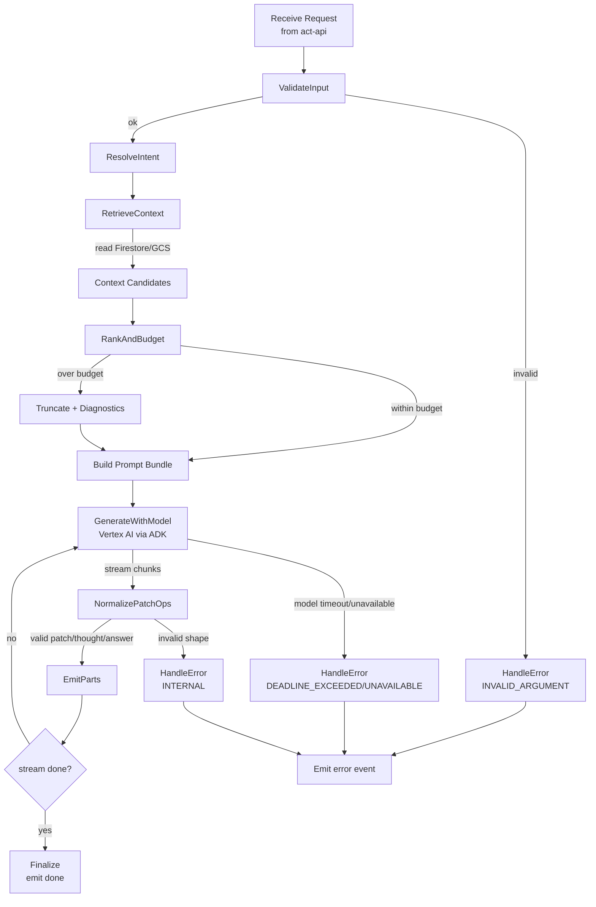
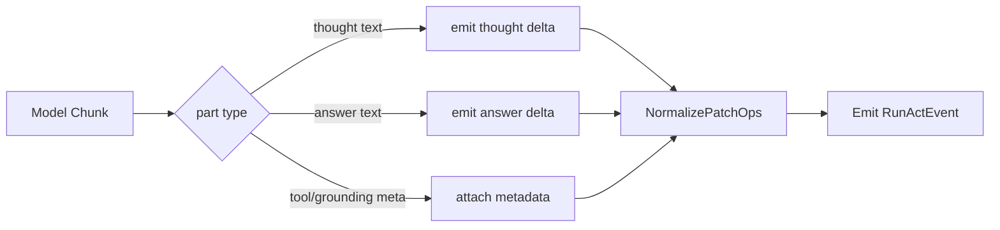
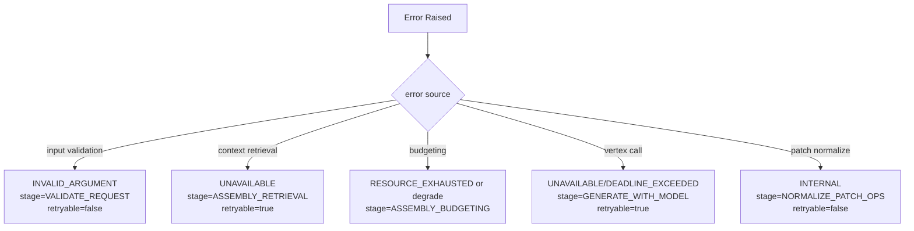

# Act ADK Runtime 仕様

Version: 1.2

本仕様は `ActService.RunAct` の内部挙動を Google ADK ベースで定義する。
外部契約は `act/specs/contracts/rpc-connect-schema.md` を正本とする。

## 目的

* `RunAct` を ADK workflow で再現可能に実行する
* thought/answer/patch のストリーミングを安定返却する
* Firestore 直接書き込みを禁止し、Draft生成に限定する

## 非目的

* Organize永続化（ApplyPatch）
* レイアウト確定
* 長期履歴DBの実装詳細

## 実行構成（MUST）

* `act-api`（Go）: Connect RPC公開、認証認可、stream変換
* `act-adk-worker`（Python + Google ADK）: Context Assembly + LLM実行

## ADK Workflow Nodes（固定）

1. `ValidateInput`
2. `ResolveIntent`
3. `RetrieveContext`
4. `RankAndBudget`
5. `GenerateWithModel`
6. `NormalizePatchOps`
7. `EmitParts`
8. `Finalize`
9. `HandleError`

## `act-adk-worker` フローチャート（詳細）

## `act-adk-worker` 出力ストリーム変換フロー

## `act-adk-worker` エラーフロー（分類）

## State（論理）

| フィールド | 説明 |
| --- | --- |
| `request` | RunActRequest |
| `trace_id` | 実行トレースID |
| `intent` | 解釈済みintent |
| `prompt_bundle` | Assembly結果 |
| `model_stream_buffer` | 増分バッファ |
| `emitted_patch_count` | 送信patch数 |
| `warnings` | 非致命警告 |
| `error` | 失敗情報 |

## 正常フロー

1. `ValidateInput`: 入力検証
2. `ResolveIntent`: intent決定
3. `RetrieveContext`: Firestore/GCS read-only取得
4. `RankAndBudget`: 文脈圧縮
5. `GenerateWithModel`: ADKでモデル実行（chunk単位）
6. `NormalizePatchOps`: `upsert|append_md` 制約適用
7. `EmitParts`: thought/answer/patch を順次送信
8. `Finalize`: `done=true` 終端

## ノード別 I/O（実装指針）

| Node | 入力 | 出力 | MUST |
| --- | --- | --- | --- |
| `ValidateInput` | RunActRequest | validated request | `topic_id` 必須、空query拒否 |
| `ResolveIntent` | query, selected nodes | intent, retrieval policy | intent未判定時は `explore` へフォールバック |
| `RetrieveContext` | topic_id, policy | candidates | Firestore/GCS read-only |
| `RankAndBudget` | candidates, token budget | compacted context, diagnostics | drop理由を diagnostics に残す |
| `GenerateWithModel` | prompt bundle | model chunks | timeout/retry を守る |
| `NormalizePatchOps` | chunks | PatchOp events | `op in {upsert, append_md}` のみ |
| `EmitParts` | normalized events | stream frames | `trace_id` を全frameに付与 |
| `Finalize` | stream state | done frame | errorとdoneを同時送信しない |
| `HandleError` | internal error | error frame | `code/stage/retryable` を埋める |

## 異常フロー（error/retryable/stage）

* 入力不正: `INVALID_ARGUMENT`, `stage=VALIDATE_REQUEST`
* assembly失敗: `ASSEMBLY_*`（retryableは条件依存）
* モデル障害: `UNAVAILABLE|DEADLINE_EXCEEDED`, `stage=GENERATE_WITH_MODEL`
* 形式不正: `INTERNAL`, `stage=NORMALIZE_PATCH_OPS`

## 数値パラメータ

* run timeout: 90s
* model retry: 2
* patch_ops max: 400
* thought flush: 500ms

## 受け入れ条件（DoD）

* ADK workflow で `RunAct` を end-to-end 説明できる
* `RunActEvent` 契約（done/error排他）を守る
* read-only境界（Assembly/ADK）を守る

## 実装メモ（最小）

* ADK未対応機能は限定的RESTラッパーを許容
* Go側は常に契約変換レイヤとして残す
