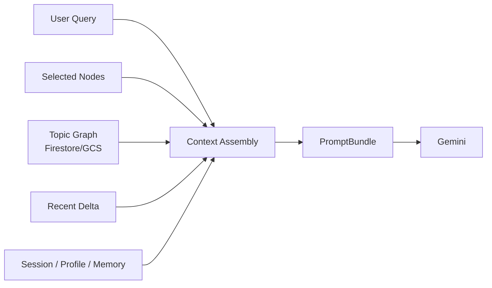
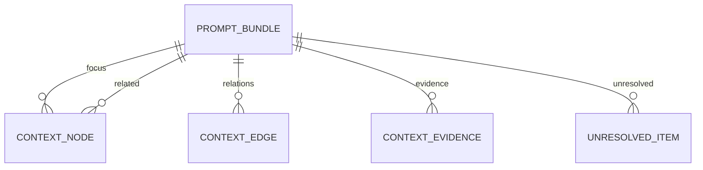
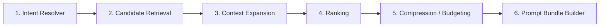

# Act Context Guide（Human View）

## Act は何を context として使うか

Act は LLM にそのまま DB を見せない。  
毎ターン、read-only で必要な材料を集めて `PromptBundle` に圧縮してから使う。

一言で言うと、

* `topic` の知識正本を読む
* 最近の変化を少し足す
* personalization を薄く重ねる
* token 予算に収まる形へ圧縮する

## 入力は何か

Act の context assembly は、だいたい次を入力にする。

* `workspaceId`
* `topicId`
* `userQuery`
* `selectedNodeIds`
* `mode`
* `tokenBudget`

つまり「どの topic を見て」「今なにを知りたいか」「どのノードに注目しているか」が入口になる。

## 読む材料は4系統

### 1. Topic 正本

これが主材料。  
Act はまず `topic` 配下の確定済み知識を読む。

主に使うもの:

* `focus`
  * 今回の質問や選択ノードに直接関係する node
* `related`
  * 近傍 node や補助 node
* `relations`
  * node 間の関係
* `evidence`
  * 根拠参照
* `unresolved`
  * 未解決点

取得元のイメージ:

* Firestore `topics/{topicId}/nodes/*`
* Firestore `topics/{topicId}/edges/*`
* Firestore `.../evidence/*`
* GCS の outline / rollup / source 本文

### 2. Recent Delta

正本だけだと最新の差分が薄くなるので、最近の変化も少し見る。

主に使うもの:

* 直近の draft 差分
* 最近更新された node
* 最近の act run / recent activity

役割:

* topic の最近の変化を反映する
* まだ outline に十分吸収されていない新情報を補う

### 3. Personalization Overlay

topic の事実を変えるためではなく、文脈の重み付けと出力方針を少し調整するために使う。

順序は次の通り。

1. `session_context`
2. `profile_context`
3. `memory_context`

役割:

* `session_context`
  * 今の画面状態、一時制約、直近の選択
* `profile_context`
  * 表示密度、言語、出力スタイル
* `memory_context`
  * よく使う比較軸、最近の作業傾向

禁止:

* personalization で topic の factual content を書き換えない

### 4. 実行時入力

ユーザーが今このターンで渡したものも文脈に入る。

* `currentUserQuery`
* `selectedNodeIds`
* `mode`
* `includeThoughtStream`

これは「何を読むか」を決めるだけでなく、「どう答えるか」にも効く。

## 最終的に何が LLM へ渡るか

最終成果物は `PromptBundle`。

主要フィールド:

* `objective`
* `currentUserQuery`
* `focus`
* `related`
* `relations`
* `evidence`
* `unresolved`
* `constraints`
* `responseInstructions`

重要なのは、DB のスキーマをそのまま渡さず、今回のターンに必要な意味だけへ圧縮して渡すこと。

## どうやって作るか

Context Assembly は 6 段階で作る。

### 1. Intent Resolver

まず今回の意図を決める。

* 比較したいのか
* 根拠が欲しいのか
* 要約したいのか
* 探索したいのか

これで retrieval policy が変わる。

### 2. Candidate Retrieval

候補 node / edge / evidence を集める。

固定的に拾うもの:

* focus nodes
* neighbors
* evidence refs
* recent deltas

### 3. Context Expansion

intent に応じて、近傍や補助情報の広がりを調整する。

例:

* compare なら比較対象ノードを厚めに取る
* ground なら evidence を厚めに取る

### 4. Ranking

集めた候補に優先度をつける。

見るもの:

* focus との近さ
* relation の強さ
* recency
* confidence
* unresolved かどうか

### 5. Compression / Budgeting

token 予算を超えるなら削る。

削減順:

1. related non-focus
2. evidence 下位
3. unresolved
4. focus を L3 -> L2 -> L1 へ圧縮

つまり focus は最後まで残す。

### 6. Prompt Bundle Builder

残った材料を `PromptBundle` と `diagnostics` にまとめる。

`diagnostics` には次を残す。

* 何件取れたか
* 何を落としたか
* token 見積もり
* `truncationReason`

## Act は Firestore/GCS から何を読むか

実装寄りに言うと、主に次を読む。

* Firestore `nodes`
* Firestore `edges`
* Firestore `evidence refs`
* Firestore `actRuns` や recent activity
* GCS `outline`
* GCS `node rollup`
* 必要なら GCS の source 本文

ただし全部をそのまま読むわけではなく、ランキングと予算圧縮のあとに必要分だけ残す。

## Organize が作った何を使うか

Act が一番ありがたく使うのは、Organize が整えた次の供給物。

| 供給物 | 主担当 | Act での用途 |
| --- | --- | --- |
| `context_summary` | A3 / A7 | focus / related の短い説明 |
| `evidence_refs` | A0 / A1 / A3 | grounding |
| `relation_importance` | A3 / A4 | ranking |
| `recent_delta` | A2 / A3 | 最近の変化 |
| `confidence/quality` | A4 / A5 | 優先順位づけ |

つまり Act は Organize の成果物を読む側であり、自分では知識正本を書き換えない。

## 例

ユーザーが `AI agent と workflow の違いを比較して` と聞き、`selectedNodeIds=["nd_agent", "nd_workflow"]` だったとする。

Act はだいたい次を集める。

* focus:
  * `nd_agent`
  * `nd_workflow`
* related:
  * `planning`
  * `tool_use`
  * `determinism`
* relations:
  * `agent -- differs_from --> workflow`
  * `agent -- has_component --> tool_use`
* evidence:
  * agent 定義の根拠
  * workflow 定義の根拠
* unresolved:
  * 境界条件が曖昧なケース
* overlay:
  * もし profile が「表形式を好む」なら responseInstructions に反映

そして LLM には「この比較を、この根拠つきで、この出力スタイルで答えろ」という形で渡す。

## Act が context として使わないもの

* Firestore の未確定 stream 状態
* Act memory の ephemeral candidate をそのまま正本として扱うこと
* personalization による factual rewrite
* Organize の中間処理ログ全部

## ひとことでまとめる

Act は、`topic` の確定済み知識を主材料に、recent delta と personalization を薄く重ね、token 予算内の `PromptBundle` に圧縮して LLM に渡す。
