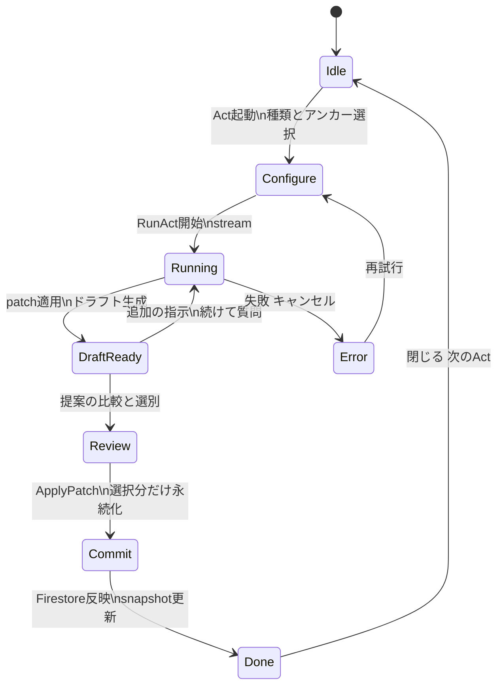
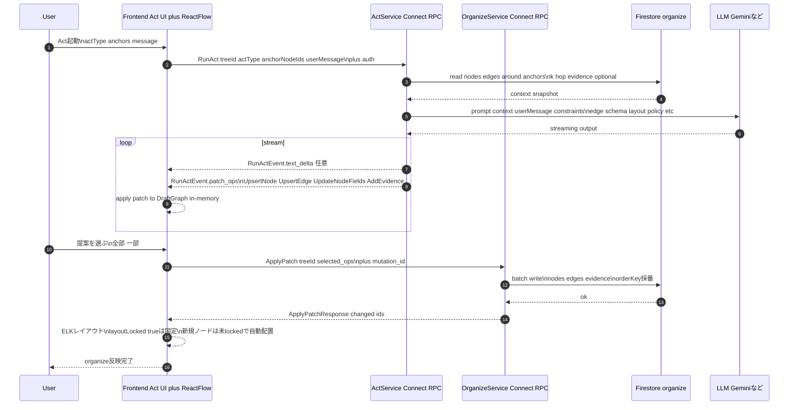
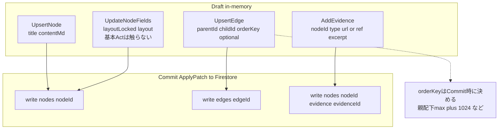
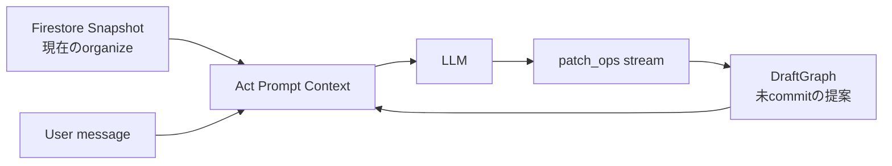

# Act フロー仕様（Draft -> Review -> Commit）

## 1. Act UI 状態遷移

決めポイント

* Actの結果は Draft インメモリ にだけ反映
* ユーザーが Commit したときだけ organize に書き込む

---

## 2. シーケンス（Frontend -> ActService -> Firestore -> LLM）

決めポイント

* RunAct は 読むだけ Firestore書き込みなし
* 永続化は ApplyPatch のみ OrganizeService
* layoutは lockedノードだけ保存 それ以外はELKで馴染ませる

---

## 3. Draft Patch の種類（edge方式）

おすすめ運用 ここで固定

* Actが orderKey を直接決めない Draftでは空でもOK
  -> Commit側で 親配下の末尾に追加 指定位置 を見て採番
* Actが layout を勝手に触らない
  -> layoutLocked layout は ユーザー操作のみ

---

## 4. フォローアップ時の扱い（Draftを文脈に含める）

---

## 5. PatchOp表現の対応（UI Composerとの整合）

フロント側で扱う `PatchOp` は、UI Composer表現と内部表現のどちらでもよい。
ただし、適用時の意味は以下で固定する。

* UI Composer `upsert`（`blocks[]`）= 内部 `UpsertNode` / `UpsertEdge` 群
* UI Composer `append_md`（`block_id`, `delta`）= 対象ノード `contentMd` への追記
* `append_md` はストリーミング描画専用で、順次適用を前提とする
* Commit時の永続化は従来どおり `ApplyPatch` のみ

---

## 6. Backend実行仕様（LangGraph）

`RunAct` の内部状態遷移は `act/backend/act-langgraph-spec.md` を正本とする。
テスト観点は `act/backend/act-e2e-test-plan.md` を参照する。
