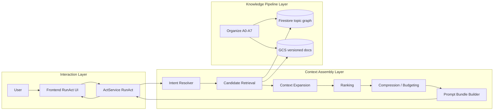

# Act フロー仕様（Interaction / Assembly / Knowledge）

## 目的

Act実行を3層で整理し、`topic_id` 中心で Draft生成からCommit導線までの責務を明確化する。

## スコープ / 非スコープ

* スコープ: RunAct実行フロー、Assembly境界、Commit導線
* 非スコープ: Organize内部アルゴリズム

## 前提・依存

* `act/specs/contracts/rpc-connect-schema.md`
* `act/specs/behavior/context-assembly-core.md`
* `organize/specs/topic-model.md`
* `organize/specs/pipeline-core.md`

## 3層構成図

## 正常フロー

1. Frontend が `RunAct(topic_id, request_id, ...)` を送る
2. Backend は auth/authz を通した後 Assembly を実行する
3. Assembly は Firestore/GCS を read-only 参照し bundle を生成する
4. LLM推論結果を `PatchOp` として stream返却する
5. Frontend は Draft in-memory を更新する
6. ユーザーが必要時のみ Organize commit を実行する

## 異常フロー（error/retryable/stage）

* auth/authz失敗は即終端
* Assembly参照失敗は retryable error
* Assembly予算不足は diagnostics付degrade
* stream途中障害は `error` 終端（`done` なし）

## 数値パラメータ

* AssemblyのMVP上限は `act/specs/behavior/context-assembly-core.md` を参照

## 受け入れ条件（DoD）

* 3層の責務が混在していない
* Assemblyが write を持たない
* topic中心の参照経路が明記されている

## 実装メモ（最小）

* CommitはOrganize write pathでのみ実行する
* Act runtimeの詳細状態は `act-langgraph-runtime.md` を参照
