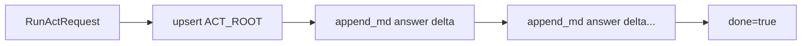
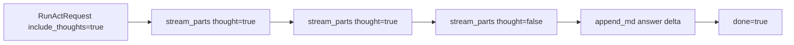
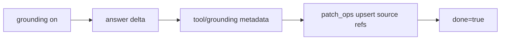
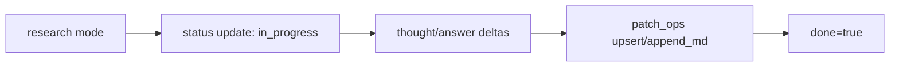
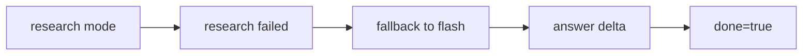
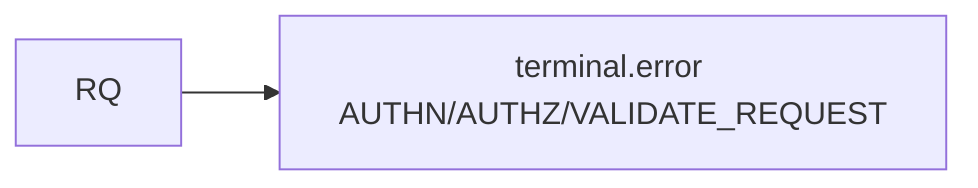
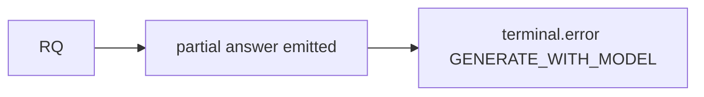
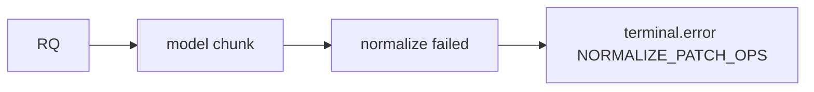
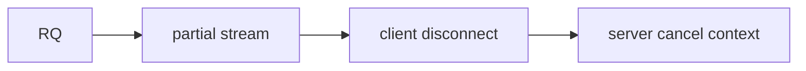
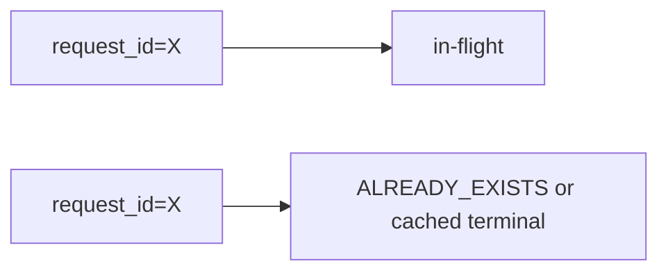

# AI Streaming Cases（Act）

## 目的

`RunAct` の AI ストリーミング挙動をケース別に固定し、frontend/backend が同じ終端・エラー挙動で実装できるようにする。

## スコープ / 非スコープ

* スコープ: `RunActEvent` の送出順序、終端、エラー、degrade
* 非スコープ: UIデザイン詳細、モデルプロンプト本文

## 前提・依存

* `act/specs/contracts/rpc-connect-schema.md`
* `act/specs/behavior/act-flow.md`
* `act/act-adk-worker/specs/act-adk-runtime.md`
* `act/specs/behavior/frontend-stream-integration.md`

## 共通ルール（MUST）

* stream は `RunActEvent` の逐次列で構成する
* `patch_ops` は `upsert | append_md` のみ
* `error` と `done` は排他
* `trace_id` は全イベントに付与する
* 途中失敗でも既送信イベントは有効（巻き戻ししない）
* 初回の本文系 `append_md` より先に、対象blockの `upsert` を送る
* 同一 event 内の基本順序は `thought -> answer -> upsert -> append_md -> metadata -> terminal` とする
* `append_md` は対象 block の `upsert` より先行しない
* metadata は本文生成を block せず、answer より先に必須化しない
* `done/error` 後に追撃 event を送らない

## Case 1: 通常回答ストリーミング（thinkingなし）

期待:

* frontend は answer buffer のみ更新
* `done=true` で loading を解除
* `ACT_ROOT upsert` が answer本文反映より先行する

## Case 2: Thinking + Answer 分離ストリーミング

期待:

* thought と answer を別stateで保持
* thought を Markdown本文へ直接混ぜない
* 同一 event 内では thought が answer より先に並ぶ

## Case 3: Grounding付き回答

期待:

* 根拠メタはイベントとして保持し、UIは参照リンク表示に使える
* 本文生成が先に来ても許容する
* metadata は answer / append_md を妨げない

## Case 4: Deep Research 成功

期待:

* 長時間実行でも中間イベントで進捗を表示可能
* 最終 `done` まで stream を維持

## Case 5: Deep Research fallback（timeout/5xx）

期待:

* fallback は同一 request 内で継続
* diagnostics/ログに fallback reason を残す

## Case 6: 生成前エラー（認証/認可/検証）

期待:

* token 1件も流さず error終端
* frontend は retryable/stage でUI分岐

## Case 7: 途中エラー（モデル障害）

期待:

* 既表示テキストは保持
* `done` は送らない

## Case 8: 正規化エラー（不正Patch）

期待:

* 不正 `op` をfrontendへ流さない
* サーバ側で `INTERNAL` に正規化

## Case 9: クライアント切断

期待:

* `act-api` は client disconnect または server deadline 検知時に worker context を即時 cancel する
* worker 側は同一 context を `GenerateWithModel` / grounding / 外部tool / polling / normalize へ伝播する
* cancel 後は新規 `RunActEvent` を生成しない
* 既送信イベントは有効のまま巻き戻さない
* cancel 起因では追加の `terminal.error` を送らない
* 再接続は再実行のみ（resumeなし）

## Case 10: 同一 request_id の再送

期待:

* 重複同時実行を防止
* 返却挙動は idempotency policy に従う

## ケース別エラー対応表

| ケース | 主な stage | retryable |
| --- | --- | --- |
| 認証/認可失敗 | `AUTHN` / `AUTHZ` | false |
| 入力不正 | `VALIDATE_REQUEST` | false |
| Context取得失敗 | `ASSEMBLY_RETRIEVE` | true |
| 予算圧縮失敗 | `ASSEMBLY_BUDGET` | true |
| モデル障害 | `GENERATE_WITH_MODEL` | true |
| Patch正規化失敗 | `NORMALIZE_PATCH_OPS` | false |
| stream送信失敗 | `EMIT_STREAM` | true |

## 受け入れ条件（DoD）

* 主要10ケースで終端挙動が一意に説明できる
* frontend が `stage/retryable` のみで再試行UIを決定できる
* thought/answer/patch の分離がケース2で確認できる
