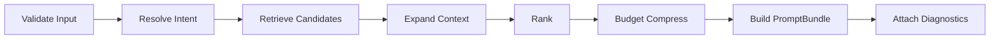

# Context Assembly 実装仕様（Decision Complete）

## 目的

`Context Assembly Layer` を、実装者が追加判断なしで着手できる粒度で定義する。

## スコープ / 非スコープ

* スコープ: 実装分割、データ取得順、ランキング、圧縮、degrade、diagnostics
* 非スコープ: LLM応答生成、Organize書き込み、UI表示ロジック

## 前提・依存

* `act/specs/context/core.md`
* `act/specs/context/bundle-schema.md`
* `organize/specs/model/topic-model.md`
* `firestore/schema.md`

## 契約（I/O）

入力は `AssembleContextInput`、出力は `AssembleContextOutput` を使用する。

### 入力必須チェック

| 項目 | 判定 |
| --- | --- |
| `workspaceId` | 空禁止 |
| `topicId` | 空禁止 |
| `userQuery` | trim後1文字以上 |
| `mode` | `act` または `organize` |
| `tokenBudget` | 1以上 |

### 出力必須チェック

| 項目 | 判定 |
| --- | --- |
| `bundle.objective` | 空禁止 |
| `bundle.currentUserQuery` | 入力クエリと一致 |
| `diagnostics.retrievedNodeCount` | 0以上 |
| `diagnostics.tokenEstimate` | 0以上 |
| `diagnostics.truncationReason` | `none`/`token_budget`/`policy` |

## 処理フロー（正常）

### 1. Validate Input

* 入力必須チェックを実施
* 失敗時は `ASSEMBLY_VALIDATE_INPUT`

### 2. Resolve Intent

#### Intent分類（固定）

| intent | 代表クエリ傾向 |
| --- | --- |
| `explain` | 説明して、とは |
| `compare` | 比較して、違い |
| `explore` | 深掘り、続きを考える |
| `ground` | 根拠を示して |
| `organize` | 整理して、統合して |
| `summarize_diff` | 前回との差分 |

#### Intent決定ルール

1. 明示キーワードがある場合は最優先
2. `mode=organize` かつ競合時は `organize` 優先
3. 不明時のデフォルトは `explore`

### 3. Retrieve Candidates

#### 取得順（固定）

1. focus nodes
2. neighbors
3. evidence
4. recent deltas

#### focus取得ルール

* `selectedNodeIds` 上位3件
* 未選択時は topic の最新更新ノード最大2件

#### neighbors取得ルール

* 基本は 1-hop、最大8件
* relation優先度: `contradicts > supports > depends_on > related_to`

#### evidence取得ルール

* focusごとに最大2件、全体最大5件
* 優先: confidence降順、同点は更新時刻降順

#### recent delta取得ルール

* `latest_outline_version` と `latest_draft_version` の差分要約
* 最大3件

### 4. Expand Context

intentごとに展開を固定する。

| intent | 展開方針 |
| --- | --- |
| `explain` | focus + 定義に必要な親子 + supports少量 |
| `compare` | 比較対象を同一属性で並列化 |
| `explore` | unresolved と近傍を広め |
| `ground` | evidence/provenance重視、summaryは薄く |
| `organize` | 重複候補、クラスタ候補を重視 |
| `summarize_diff` | recent delta中心 |

### 5. Rank

#### Node score（実装式）

`score = focus_match*0.30 + relation_importance*0.20 + recency*0.15 + confidence*0.15 + user_selection_boost*0.10 + unresolved_boost*0.10`

#### Evidence score（実装式）

`score = linked_to_focus*0.35 + source_quality*0.20 + freshness*0.20 + contradiction_value*0.15 + citation_reuse*0.10`

#### 正規化

* 各要素スコアは0〜1で正規化
* 欠損値は0として扱う（エラー化しない）

### 6. Budget Compress

#### 圧縮レベル

| レベル | 内容 |
| --- | --- |
| L3 | 根拠複数、provenance、delta含む |
| L2 | summary + key points +根拠1件 |
| L1 | id/title/type/statusのみ |

#### 圧縮手順（固定）

1. non-focus related を L3→L2→L1
2. evidence を上位以外削減
3. unresolved を最大3件に制限
4. focusは最低L1保証

#### token超過時の最終挙動

* `truncationReason=token_budget`
* drop対象を diagnostics に必ず記録

### 7. Build PromptBundle

* `objective` は intentに応じた短文テンプレから生成
* `currentUserQuery` は入力をそのまま保持
* `focus`, `related`, `relations`, `evidence`, `unresolved`, `constraints`, `responseInstructions` を埋める

### 8. Attach Diagnostics

必須埋め:

* `retrievedNodeCount`
* `retrievedEvidenceCount`
* `droppedNodeIds`
* `droppedEvidenceIds`
* `tokenEstimate`
* `truncationReason`

## 異常フロー（error/retryable/stage）

| stage | 条件 | code | retryable | 振る舞い |
| --- | --- | --- | --- | --- |
| `ASSEMBLY_VALIDATE_INPUT` | 入力不正 | `INVALID_ARGUMENT` | false | 即終了 |
| `ASSEMBLY_RETRIEVE` | Firestore/GCS参照失敗 | `UNAVAILABLE` | true | 最小bundle degradeを試行 |
| `ASSEMBLY_RANK` | score計算不能 | `INTERNAL` | true | フォールバック順位で継続 |
| `ASSEMBLY_BUDGET` | 圧縮失敗 | `INTERNAL` | true | L1のみで最小bundle返却 |

## 数値パラメータ（固定）

* `selectedNodeIds_max = 3`
* `neighbors_max = 8`
* `evidence_per_focus_max = 2`
* `evidence_total_max = 5`
* `unresolved_max = 3`

## 受け入れ条件（DoD）

1. 同一入力で同一bundle順序を再現できる
2. token超過時に diagnostics へdrop理由が残る
3. read-only境界を破らない
4. `outline優先 + draft差分補助` を守る

## テストシナリオ（仕様）

1. 選択ノードあり explain
- 期待: focus中心、supports少量、`truncationReason=none`

2. 選択ノードなし explore
- 期待: latest更新ノードをfocus補完

3. ground要求 + 低予算
- 期待: evidence上位のみ残り `truncationReason=token_budget`

4. Firestore一時失敗
- 期待: retryable true、最小bundle degrade

5. ranking特徴量欠損
- 期待: fallback順位で継続、error終端しない

## 実装メモ（最小）

* 実装分割は `Retriever` / `Assembler` / `Renderer` / `DiagnosticsRecorder`
* 並列取得は focus, neighbor, evidence まで。ranking以降は単一スレッドで順序固定
* diagnosticsは構造化ログにも同時出力する
