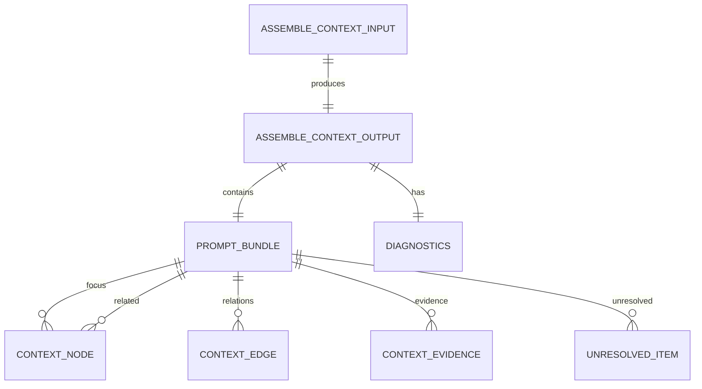

# Context Bundle Schema 仕様

## 目的

LLM呼び出し直前の一時文脈フォーマットを固定し、Act/Organize間の受け渡しを安定化する。

## スコープ / 非スコープ

* スコープ: `AssembleContextInput/Output`, `PromptBundle`, `diagnostics`
* 非スコープ: Retriever実装、モデルプロンプト文面

## 前提・依存

* `organize/specs/topic-model.md`
* `act/specs/behavior/context-assembly-core.md`

## 契約（I/O）

### AssembleContextInput

| フィールド | 必須 | 説明 |
| --- | --- | --- |
| `workspaceId` | 必須 | workspace境界 |
| `topicId` | 必須 | 知識正本キー |
| `userQuery` | 必須 | ユーザー要求文 |
| `selectedNodeIds` | 必須 | UIで選択されたノードID群 |
| `mode` | 必須 | `act` または `organize` |
| `tokenBudget` | 必須 | 今回ターンの予算 |
| `includeThoughtStream` | 任意 | thought出力の要求 |

### PromptBundle

| セクション | 説明 |
| --- | --- |
| `objective` | ターン目的の短文 |
| `currentUserQuery` | 入力クエリ原文 |
| `focus` | 中心ノード群 |
| `related` | 周辺ノード群 |
| `relations` | ノード間関係（impact要約含む） |
| `evidence` | 根拠断片と参照情報 |
| `unresolved` | 未解決事項 |
| `constraints` | モデル制約 |
| `responseInstructions` | 回答スタイル指定 |

### AssembleContextOutput

| フィールド | 説明 |
| --- | --- |
| `bundle` | LLMに渡す文脈本体 |
| `diagnostics.retrievedNodeCount` | 取得ノード数 |
| `diagnostics.retrievedEvidenceCount` | 取得根拠数 |
| `diagnostics.droppedNodeIds` | 予算/方針で落としたノード |
| `diagnostics.droppedEvidenceIds` | 予算/方針で落とした根拠 |
| `diagnostics.tokenEstimate` | 推定トークン数 |
| `diagnostics.truncationReason` | `none` / `token_budget` / `policy` |

### 構造図（ER）

## 正常フロー

1. `AssembleContextInput` を受ける
2. `PromptBundle` を組み立てる
3. `diagnostics` を必ず付与して返す

## 異常フロー（error/retryable/stage）

* `topicId` 欠落: `INVALID_ARGUMENT`, `retryable=false`, `stage=ASSEMBLY_VALIDATE_INPUT`
* `tokenBudget` 異常値: `INVALID_ARGUMENT`, `retryable=false`, `stage=ASSEMBLY_VALIDATE_INPUT`
* context不足: degradeで最小bundleを返却（エラーにしない）

## 数値パラメータ

* `selectedNodeIds` 推奨上限: 3
* `related` 推奨上限: 8
* `evidence` 推奨上限: focusごとに2

## 受け入れ条件（DoD）

* outputに diagnostics が必ず存在する
* token予算超過時に `truncationReason` が記録される
* bundleは read-only context であり永続化前提を含まない

## 実装メモ（最小）

* bundleはJSONでモデルへ渡せる粒度に保つ
* DBスキーマをそのままモデルへ渡さない
