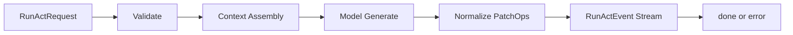

# Act Connect RPC Schema（自然言語版）

Version: v1.1  
Owner: Act Domain

## 目的

Act の Connect RPC 契約を `topic_id` 中心で定義し、コード断片なしで人間可読に固定する。

## スコープ / 非スコープ

* スコープ: `RunAct` の request/response stream 契約
* 非スコープ: Organize write API、実装コード

## 前提・依存

* `context/assembly/bundle-schema.md`
* `context/assembly/core.md`
* `context/model/topic-model.md`

## サービス契約

* サービス名: `ActService`
* RPC名: `RunAct`
* 通信形態: server-streaming

## RunActRequest フィールド

| フィールド | 必須 | 説明 |
| --- | --- | --- |
| `topic_id` | 必須 | 知識正本キー |
| `tree_id` | 任意 | UIスコープキー |
| `act_type` | 必須 | 実行タイプ（explore/consult/investigate） |
| `anchor` | 任意 | 起点ノード情報 |
| `anchor_node_ids` | 任意 | 起点ノード群 |
| `user_message` | 必須 | ユーザー入力 |
| `context_node_ids` | 任意 | 明示コンテキストノード |
| `workspace_id` | 必須 | workspace境界 |
| `uid` | 任意（互換） | 旧クライアント互換用。認証正本には使わない（deprecated） |
| `llm_config` | 任意 | モデル設定 |
| `grounding_config` | 任意 | grounding設定 |
| `thinking_config` | 任意 | thought設定 |
| `research_config` | 任意 | deep research設定 |
| `request_id` | 必須 | 冪等用UUID |
| `sid` | 任意 | 互換用セッション識別子（cookie正本） |

## RunActEvent フィールド

| フィールド | 説明 |
| --- | --- |
| `text_delta` | 通常テキストの増分 |
| `patch_ops` | `upsert` / `append_md` の配列 |
| `stream_parts` | thought/answer の分離ストリーム |
| `metadata` | grounding/tool/diagnostics の正規化済みメタ |
| `terminal.done` | 正常終端 |
| `terminal.error` | 異常終端（ErrorInfo） |

## ErrorInfo フィールド

| フィールド | 必須 | 説明 |
| --- | --- | --- |
| `code` | 必須 | エラーコード |
| `message` | 必須 | 表示向けメッセージ |
| `retryable` | 必須 | 再試行可否 |
| `stage` | 必須 | 失敗フェーズ |
| `trace_id` | 必須 | ログ相互参照キー |
| `retry_after_ms` | 任意 | 再試行待機時間 |

## ErrorStage 一覧

| stage | 説明 |
| --- | --- |
| `AUTHN` | 認証失敗 |
| `SID_VALIDATE` | sid検証失敗 |
| `CSRF_VALIDATE` | csrf検証失敗 |
| `AUTHZ` | 認可失敗 |
| `VALIDATE_REQUEST` | 入力検証失敗 |
| `ASSEMBLY_VALIDATE_INPUT` | assembly入力不正 |
| `ASSEMBLY_RETRIEVE` | context取得失敗 |
| `ASSEMBLY_RANK` | ranking処理失敗 |
| `ASSEMBLY_BUDGET` | 予算圧縮処理失敗 |
| `GENERATE_WITH_MODEL` | モデル呼び出し失敗 |
| `NORMALIZE_PATCH_OPS` | patch正規化失敗 |
| `EMIT_STREAM` | stream送信失敗 |
| `FINALIZE` | 終端処理失敗 |

## PatchOp 契約

| op | 説明 |
| --- | --- |
| `upsert` | blockの追加/更新 |
| `append_md` | 指定blockへのmarkdown追記 |

補足:

* `append_md` には request 内で単調増加する `seq` を持たせる
* `append_md` には適用前本文長を示す `expected_offset` を持たせる
* frontend は `request_id + block_id + seq` を重複排除キーとして扱えるようにする

## フロー図

## Contract Rules（MUST）

* `topic_id` は必須
* `tree_id` は optional（UI scope）
* `RunAct` は read-only（Firestore/GCS write禁止）
* Context Assembly は `context/assembly/core.md` に従う
* `patch_ops` は `upsert` / `append_md` のみ
* 初回の本文系 `append_md` より先に、対象blockの `upsert` を送る
* 同一 `RunActEvent` 内の基本順序は `thought -> answer -> upsert -> append_md -> metadata -> terminal` とする
* `append_md` は対応する block の `upsert` より先行してはならない
* `append_md` は空文字を送らない
* `append_md.seq` は request 内で単調増加し、再送時も同一値を再利用する
* `append_md.expected_offset` が合わない場合、frontend は適用を拒否するか再同期扱いにできる
* `done` と `error` は最後の event にのみ現れる
* `done` と `error` は排他
* 終端後に追加 event を送らない
* `metadata` は frontend 表示に必要な最小 shape へ正規化し、SDK 依存の raw payload 全量を含めない
* 冪等キーは `(token_uid, workspace_id, request_id)`
* `sid` は補助識別子であり認証正本ではない
* `request.uid` は互換用であり、実処理は token claim の `uid` を使う
* エラー時は `retryable`, `stage`, `trace_id` を必須返却

## Frontend Mapping

* `upsert`: stateへ block追加/更新
* `append_md`: `contentMd` 追記
* `stream_parts.thought=true`: thinkthrough表示
* `stream_parts.thought=false`: 通常回答表示
* node 本文 state の正本は `append_md`
* `stream_parts` / `text_delta` は逐次表示用バッファとして扱える
* `metadata.grounding` は `References`、`metadata.tools` は `Diagnostics` に投影できる
* `error`: stage/retryableでUI分岐

## References

* `act/act-api/specs/runtime/runact-implementation.md`
* `act/specs/behavior/act-flow.md`
* `context/assembly/bundle-schema.md`
