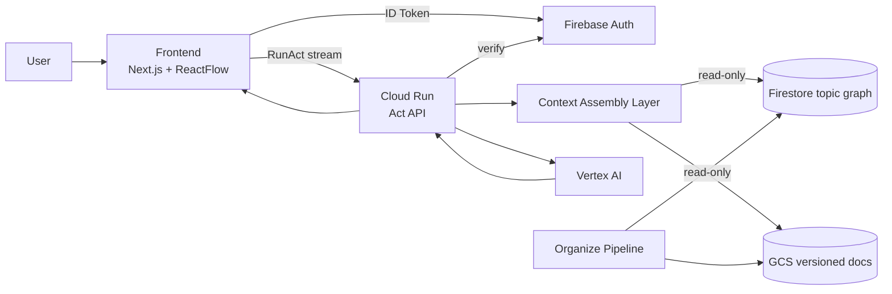

# Act Architecture

## 目的

Act の実行経路を `Interaction / Context Assembly / Knowledge Pipeline` の3層で固定し、`topic_id` 中心で説明可能にする。

## スコープ / 非スコープ

* スコープ: RunActオンライン経路、認証、Assembly境界、データ参照
* 非スコープ: Organize内部処理の詳細

## 前提 / 参照

* `organize/specs/topic-model.md`
* `act/specs/behavior/context-assembly-core.md`
* `act/specs/contracts/context-bundle-schema.md`
* `act/specs/contracts/rpc-connect-schema.md`
* `firestore/schema.md`

## 構成図

## リクエスト経路（RunAct）

1. Frontend が ID Token を取得
2. Frontend が `RunAct(topic_id, tree_id?, request_id, ...)` 呼び出し
3. Act API が auth/authz 検証
4. Act API が Context Assembly（read-only）で bundle 生成
5. Act API が Vertex AI を呼び stream を返却
6. Frontend は Draft反映し、必要時のみ Organize commit 実行

## コンポーネント責務

* Frontend: stream反映、thought表示、commit起点
* Act API: 認証認可、assembly実行、モデル呼び出し、stream正規化
* Context Assembly: topicグラフ断面生成（read-only）
* Organize: 知識正本の更新（write-only）
* Firestore/GCS: topic正本ストア

## MUST / 制約

* 知識正本キーは `topic_id`
* `tree_id` は UI scope のみ
* Assemblyは Firestore/GCS に書き込まない
* Organizeは RunAct stream を emit しない
* 認証は Firebase Auth `google.com` のみ

## エラー / 例外

* Auth失敗: `UNAUTHENTICATED`
* Topicアクセス違反: `PERMISSION_DENIED`
* Assembly参照失敗: `UNAVAILABLE`
* LLM timeout: `DEADLINE_EXCEEDED`

## 完了条件（DoD）

* 3層責務が明確に分離されている
* topic中心参照が文書化されている
* shared仕様参照が整合している
