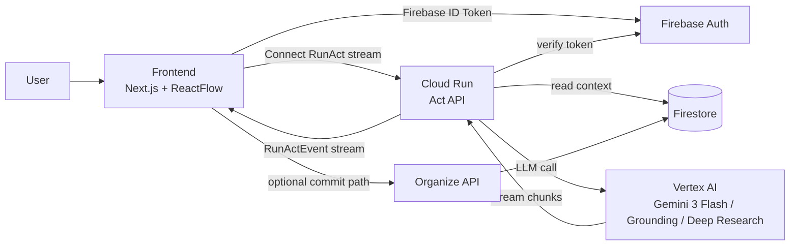

# Act Architecture

## 目的

Act の実行経路を、Frontend固定・Backend実行基盤（Cloud Run）・認証/データ基盤（Firebase Auth / Firestore）で明確化する。

## スコープ / 非スコープ

* スコープ: `RunAct` のオンライン経路、認証、データ参照、ストリーミング返却
* 非スコープ: Organize の内部パイプライン処理詳細

## 前提 / 参照

* `frontend/frontend-spec.md`
* `act/specs/contracts/rpc-connect-schema.md`
* `act/specs/behavior/connect-server.md`
* `act/specs/behavior/access-control-middleware.md`
* `act/specs/behavior/act-langgraph-runtime.md`
* `firestore/schema.md`

## 構成図

## リクエスト経路（RunAct）

1. Frontend が Firebase Auth の ID Token を取得
2. Frontend が Connect で `RunAct` を server-streaming 呼び出し
3. Cloud Run が token を検証し、`uid/workspace` を確定
4. Cloud Run が Firestore から context（nodes/edges/evidence）を読取
5. Cloud Run が Vertex AI を呼び、`PatchOp` と text/thought を逐次生成
6. Cloud Run が `RunActEvent` をフロントへストリーミング返却
7. Frontend は Draft に反映し、必要時のみ Organize 側 commit を実行

## コンポーネント責務

* Frontend:
  * Stream受信と Draft描画
  * thought/answer の分離表示
  * commit操作の起点
* Cloud Run (Act API):
  * 認証検証
  * access-control middleware（workspace/tree認可）
  * コンテキスト読取
  * LLM呼び出しと `RunActEvent` 正規化
* Firebase Auth:
  * ID Token 発行
  * token 検証基盤
* Firestore:
  * nodes/edges/evidence の参照元
* Vertex AI:
  * モデル推論（Flash / Grounding / Deep Research）

## MUST / 制約

* `PatchOp` は `upsert` / `append_md` のみ
* `done` / `error` は同一Runで排他
* 認証は Firebase Auth の Google Provider（`google.com`）のみ許可
* 認可は middleware で `uid/workspace/tree` 一貫検証を必須化
* token未検証のまま Firestore を読まない
* Cloud Run は stateless を維持し、Draft永続化をしない

## エラー / 例外

* Auth失敗（無効token / Google以外provider）: `UNAUTHENTICATED`
* Firestore読み取り失敗: `UNAVAILABLE` または `FAILED_PRECONDITION`
* LLM timeout: `DEADLINE_EXCEEDED`
* LLM一時障害: `UNAVAILABLE`（再試行後失敗で終端）

## 完了条件（DoD）

* Frontend -> Cloud Run -> Firestore/Vertex -> Frontend の経路が一意に説明できる
* 認証境界とデータ境界が文書化されている
* 既存の契約/挙動仕様と参照が循環なく接続されている
