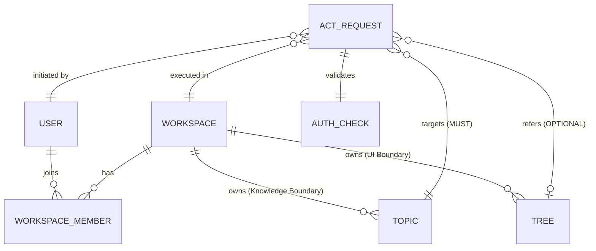
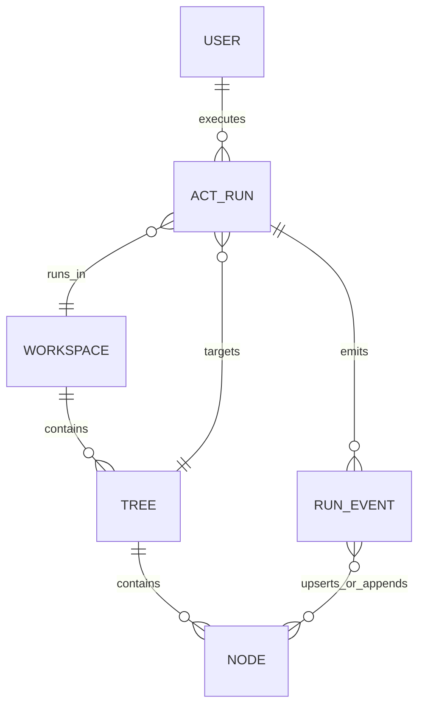
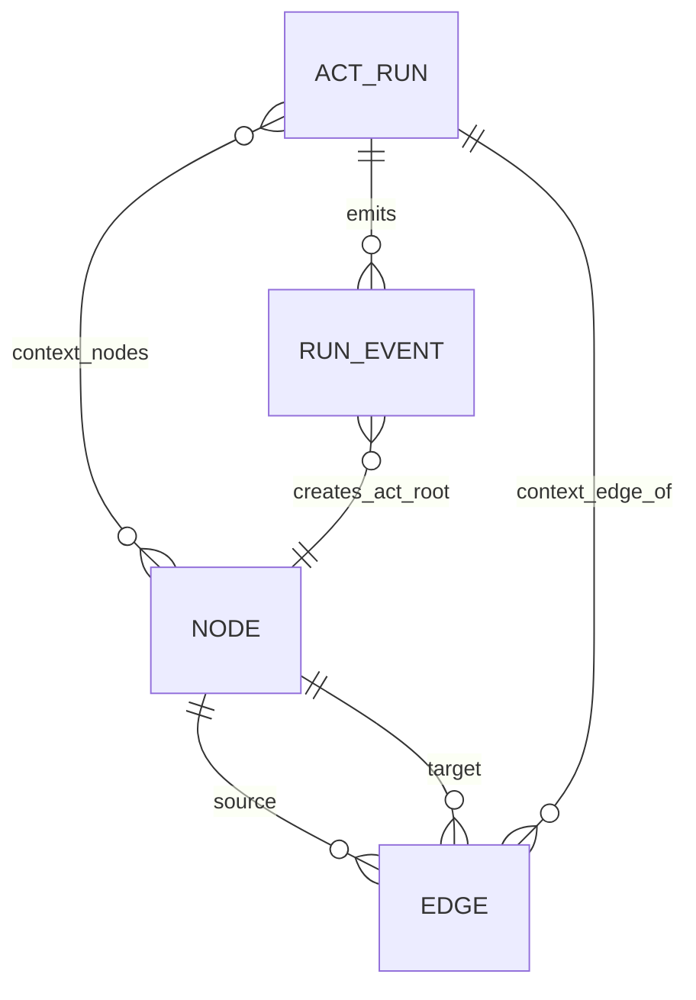
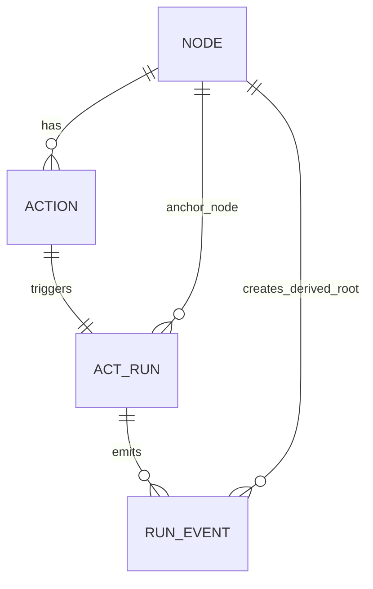
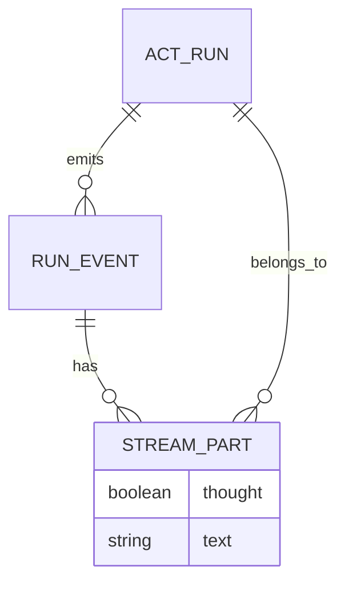
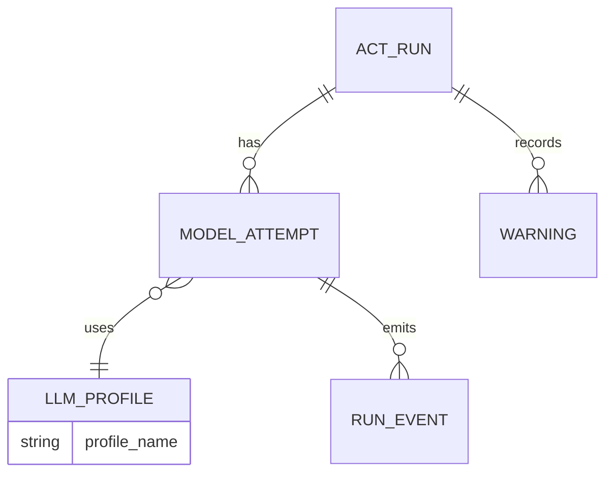
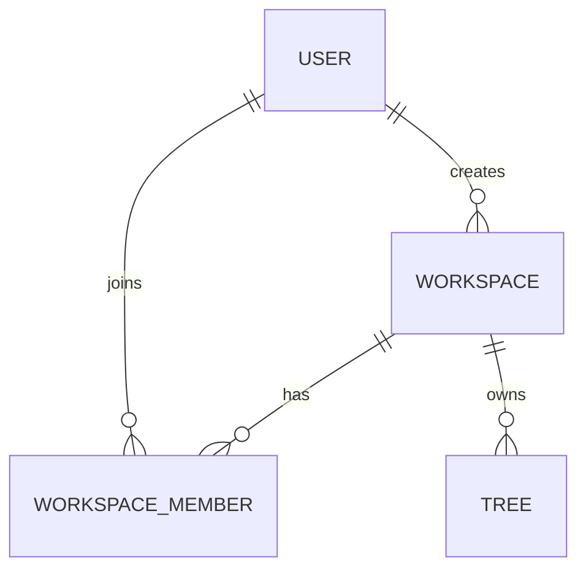
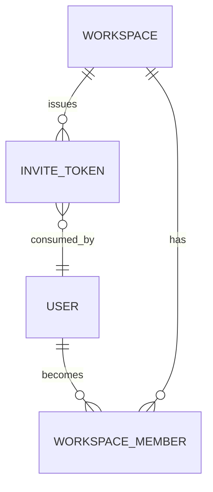
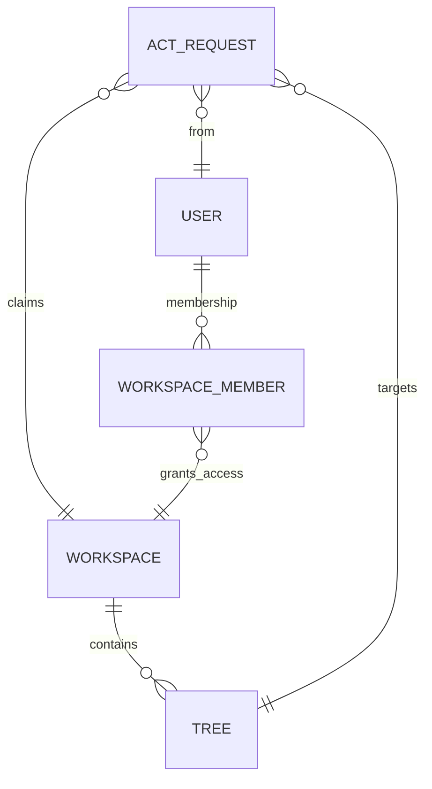
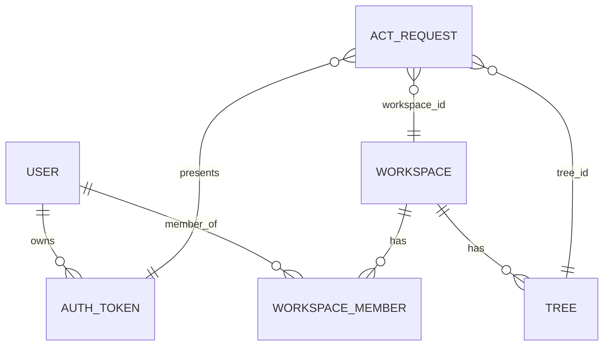

# Usecase ER Diagrams (Authorization & Scope)

## 目的

Act における「認可境界」と「実行スコープ」の関係を可視化し、実装時の検証ロジック漏れを防ぐ。

## 1. Authorization & Scope Boundary

Workspace を中心とした認可とデータの所属関係。



## 2. Validation Logic Flow

Act Request 受信時の検証ロジック（Middleware / Handler）。

```mermaid
flowchart TD
    Start([RunAct Request]) --> AuthN{Valid Token?}
    AuthN -- No --> ErrAuthN[UNAUTHENTICATED]
    AuthN -- Yes --> AuthZ_Member{User is Member<br/>of Workspace?}
    
    AuthZ_Member -- No --> ErrAuthZ[PERMISSION_DENIED]
    AuthZ_Member -- Yes --> CheckTopic{Topic belongs<br/>to Workspace?}
    
    CheckTopic -- No --> ErrTopic[PERMISSION_DENIED<br/>(Cross-boundary access)]
    CheckTopic -- Yes --> HasTree{Tree ID provided?}
    
    HasTree -- No --> Exec[Execute Act]
    HasTree -- Yes --> CheckTree{Tree belongs<br/>to Workspace?}
    
    CheckTree -- No --> ErrTree[PERMISSION_DENIED<br/>(Cross-boundary access)]
    CheckTree -- Yes --> Exec
```

## 3. Usecase Specific Diagrams

詳細挙動は各usecase本文を正本とする。

## UC-ASK-EMPTY-01



## UC-ASK-CONTEXT-01



## UC-RUNACT-NODE-01



## UC-THINK-STREAM-01



## UC-DEEP-FALLBACK-01



## UC-WORKSPACE-CREATE-01



## UC-WORKSPACE-INVITE-01



## UC-WORKSPACE-AUTHZ-01



## 共通（認証・認可チェック）



## データ構造（主要フィールド）

### Core Entities

| Entity | Key Fields | Notes |
|---|---|---|
| `USER` | `uid`, `email`, `provider` | `provider=google.com` を前提 |
| `WORKSPACE` | `workspace_id`, `name`, `created_by`, `created_at` | ユーザーは複数作成可 |
| `WORKSPACE_MEMBER` | `workspace_id`, `uid`, `role`, `joined_at` | `role`: `owner/member` |
| `TREE` | `tree_id`, `workspace_id`, `title` | 認可で `workspace_id` 整合必須 |
| `NODE` | `id`, `tree_id`, `kind`, `parent_id`, `content_md` | `kind` は `ACT_ROOT` など |
| `EDGE` | `id`, `source_id`, `target_id`, `edge_type` | `edge_type`: `structure/context` |

### Act Stream Entities

| Entity | Key Fields | Notes |
|---|---|---|
| `ACT_REQUEST` | `request_id`, `uid`, `workspace_id`, `tree_id`, `act_type` | 冪等キー: `(uid, workspace_id, request_id)` |
| `ACT_RUN` | `trace_id`, `request_id`, `status`, `started_at` | status: `running/done/error` |
| `RUN_EVENT` | `trace_id`, `seq`, `patch_ops[]`, `text_delta`, `terminal` | `done/error` 排他 |
| `STREAM_PART` | `text`, `thought` | thinkthrough分離表示用 |
| `ERROR_INFO` | `code`, `message`, `retryable`, `stage`, `trace_id` | `retry_after_ms` は任意 |

### Workspace Invite Entities

| Entity | Key Fields | Notes |
|---|---|---|
| `INVITE_TOKEN` | `token_id`, `workspace_id`, `issued_by`, `expires_at`, `consumed_by` | 短寿命トークン前提 |

## 構造ルール（MUST）

* `ACT_REQUEST.workspace_id` と `TREE.workspace_id` が一致しない場合は拒否
* `WORKSPACE_MEMBER` が存在しない `uid` は `PERMISSION_DENIED`
* `ACT_REQUEST.request_id` は UUID で、同一キー重複は `ALREADY_EXISTS`
* `RUN_EVENT.error` には `stage/retryable/trace_id` を必ず含める
