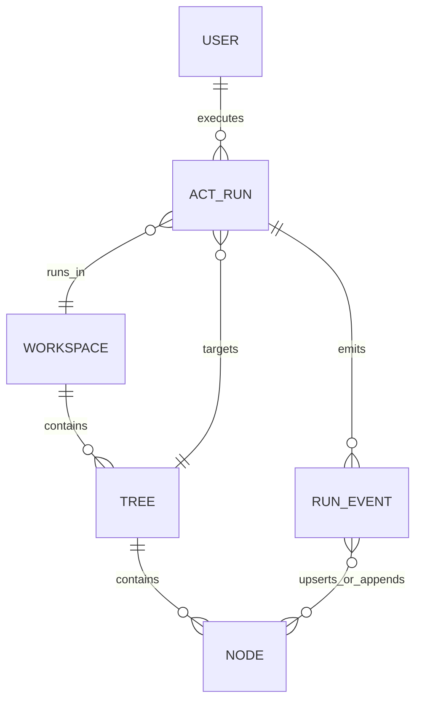
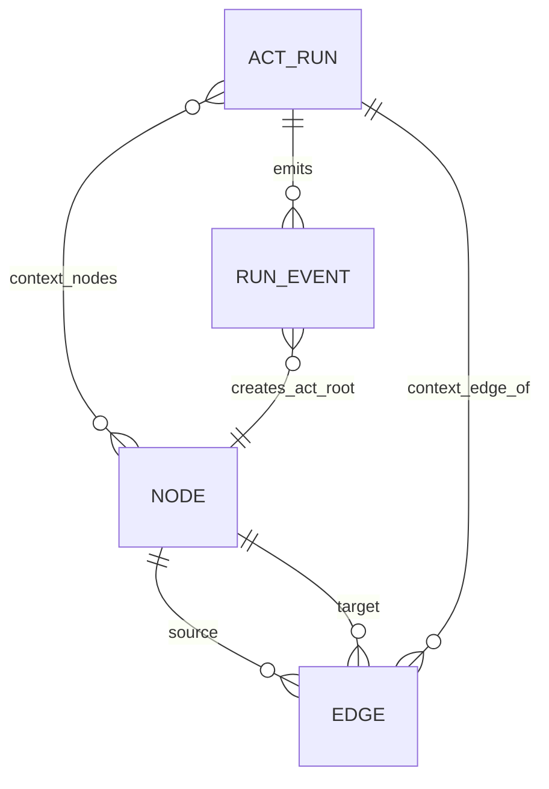
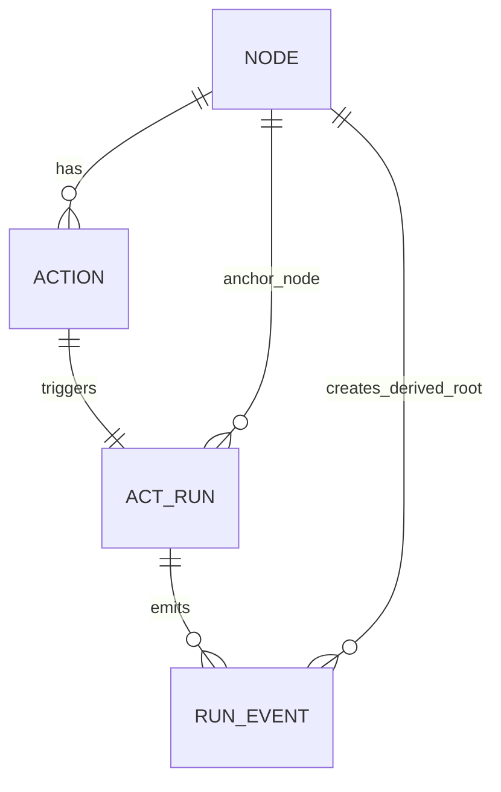
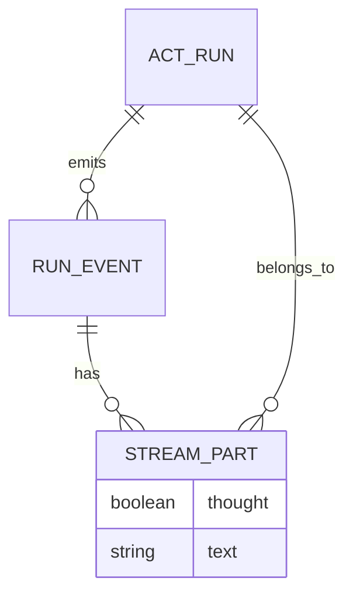
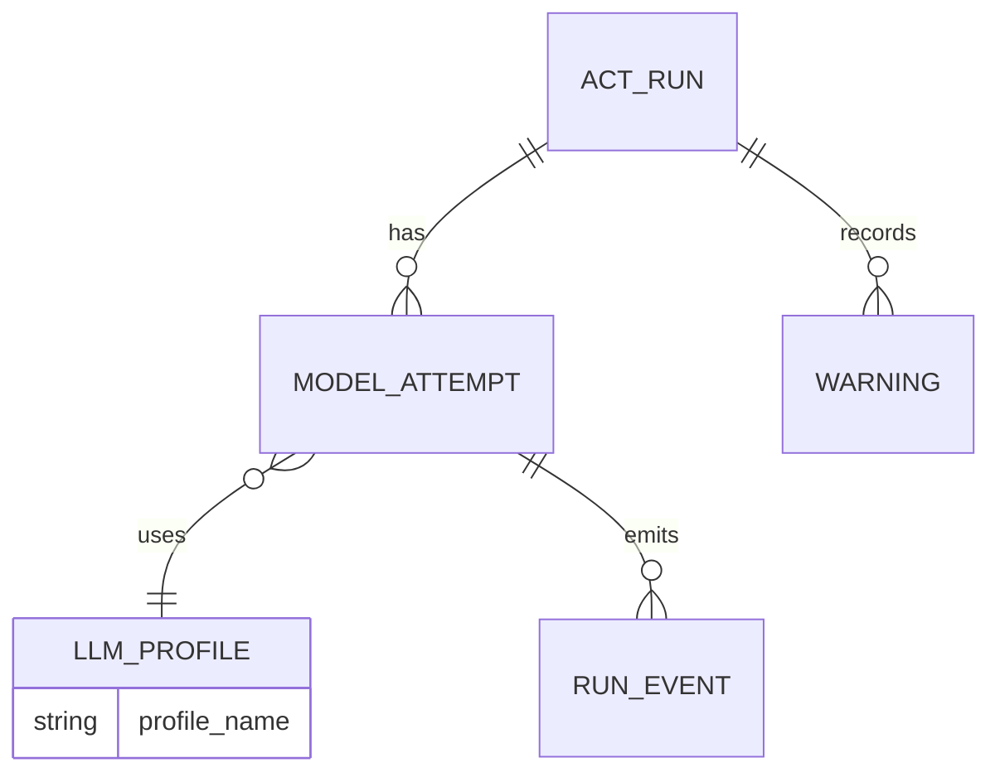
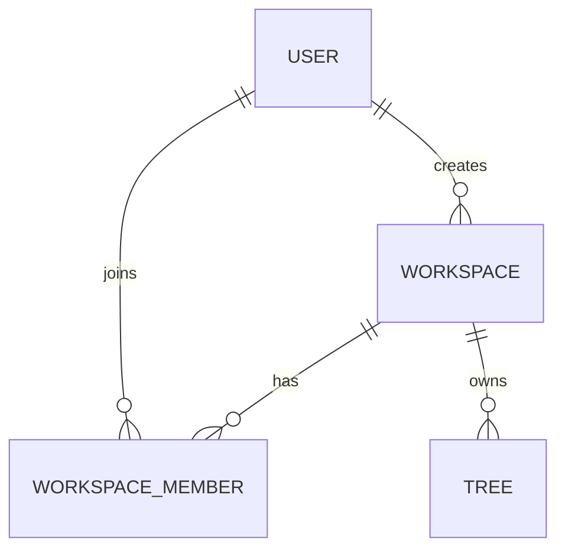
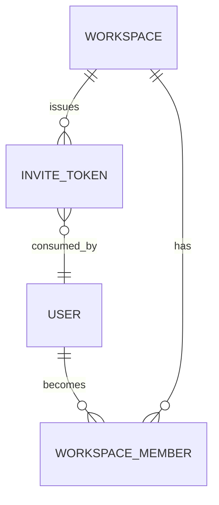
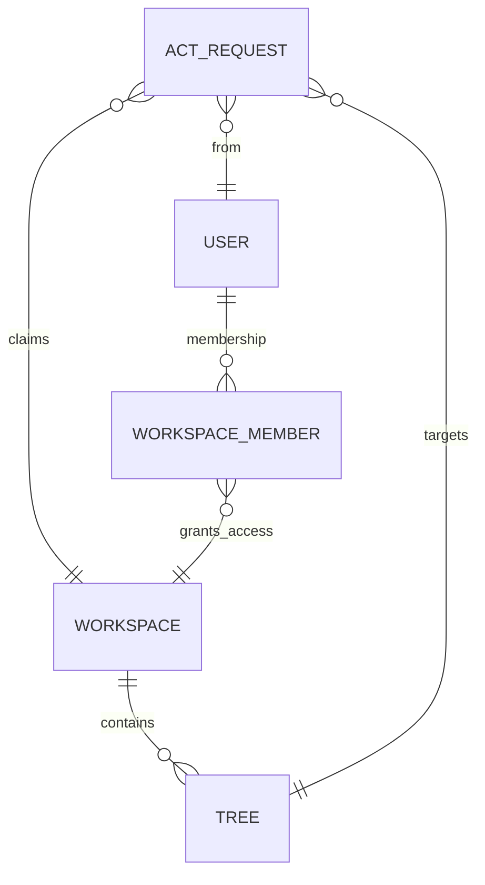
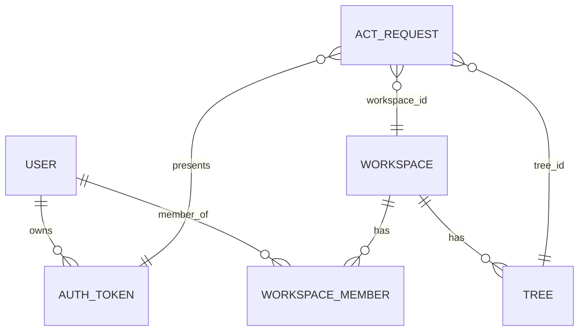

# Usecase ER Diagrams

Usecaseごとのデータ関係をER図で示す。
詳細挙動は各usecase本文を正本とする。

## UC-ASK-EMPTY-01

## UC-ASK-CONTEXT-01

## UC-RUNACT-NODE-01

## UC-THINK-STREAM-01

## UC-DEEP-FALLBACK-01

## UC-WORKSPACE-CREATE-01

## UC-WORKSPACE-INVITE-01

## UC-WORKSPACE-AUTHZ-01

## 共通（認証・認可チェック）

