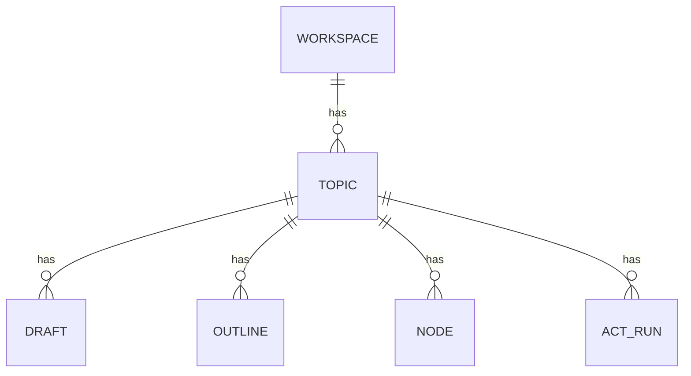

# Topic Model 仕様

## 目的

`topic` を知識正本の最小単位として固定し、Act/Organize/Firestore のキー体系を統一する。

## スコープ / 非スコープ

* スコープ: `topic`, `draft`, `outline`, `act_run` の責務と関係
* 非スコープ: UI画面の詳細、実装コード

## 前提・依存

* `context/assembly/bundle-schema.md`
* `organize/specs/pipeline/core.md`
* `firestore/schema.md`

## 契約（I/O）

入力:

* `workspace_id`
* `topic_id`
* `uid`

出力:

* topic配下の `drafts`, `outlines`, `nodes`, `act_runs` 参照
* `latest_outline_version`, `latest_draft_version`

## 論理モデル（ER）

## 正常フロー

1. ユーザーが新しい調査目的を開始すると `topic` を作成する
2. Organize が入力を `draft` へ反映し、`draft version` を進める
3. Cleaner が確定可能な内容を `outline` へ昇格し、`outline version` を進める
4. Act は `outline` を主参照し、必要時のみ `draft recent delta` を補助参照する
5. Runごとの実行記録は `act_run` として topic 配下へ残す

責務補足:

* Organize は `draft -> pipeline bundle -> outline` の write path を担当
* Act は `RunAct` で read path を担当し、`act-adk-worker` で Context Assembly を実行する

## 異常フロー（error/retryable/stage）

* `topic_id` 不在: `INVALID_ARGUMENT`, `retryable=false`, `stage=VALIDATE_REQUEST`
* workspace越境 topic 参照: `PERMISSION_DENIED`, `retryable=false`, `stage=AUTHZ`
* `latest_outline_version` 欠損: `FAILED_PRECONDITION`, `retryable=true`, `stage=LOAD_CONTEXT`

## 数値パラメータ

* `topic_id` は workspace 内で一意
* `draft` / `outline` version は単調増加（+1）

## 受け入れ条件（DoD）

* 全仕様で知識正本キーが `topic_id` に統一されている
* Act参照順が `outline優先 + draft補助` で固定されている
* Organize write path が topic境界を越えない

## 実装メモ（最小）

* `tree_id` はUI表示境界として併存してよいが、知識正本キーには使わない
* `outlineId` は新規仕様で使用しない
