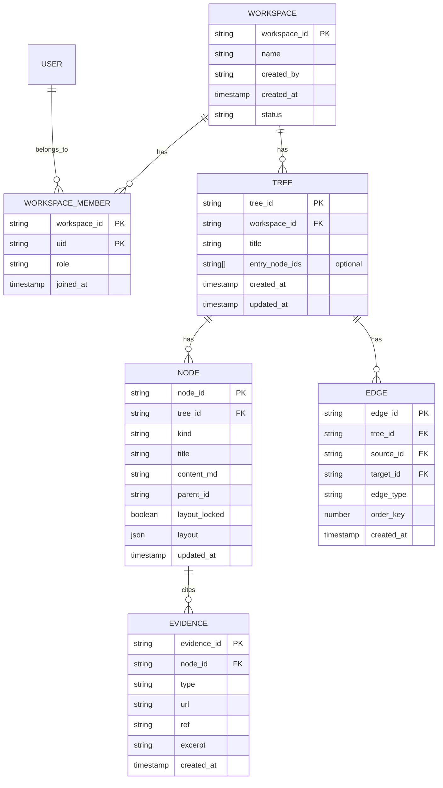
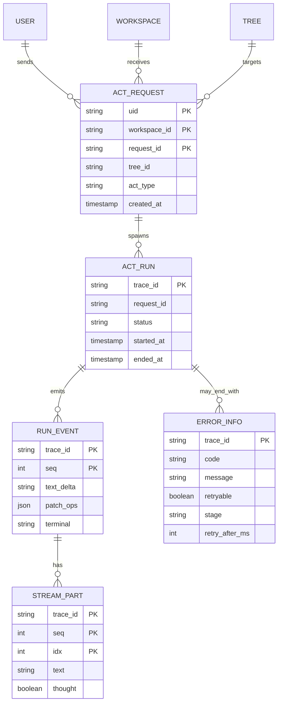
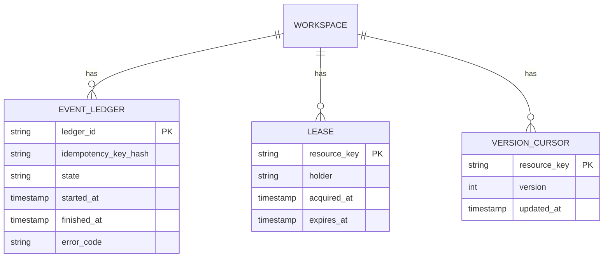
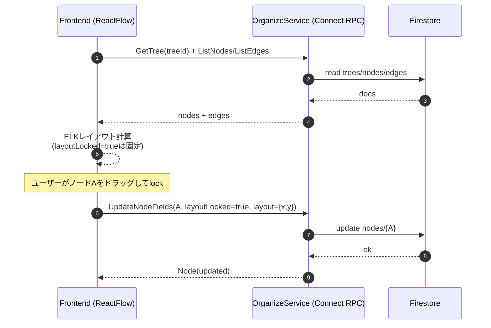

# Firestore スキーマ仕様（統合版）

目的: DB周りの論理モデルとFirestore物理配置を、実装に使える粒度で固定する。

## 1. スコープ

* Act実行に必要な認証/認可/冪等
* 知識グラフ（tree/node/edge/evidence）
* Organize運用（ledger/lease/version）

## 2. 論理ER（Core Knowledge Graph）



## 3. 論理ER（Act Runtime / Idempotency）



## 4. 論理ER（Operations / Conflict Control）



## 5. Firestore 物理パス（推奨）

```txt
workspaces/{workspaceId}
workspaces/{workspaceId}/members/{uid}
workspaces/{workspaceId}/invites/{inviteId}
workspaces/{workspaceId}/trees/{treeId}
workspaces/{workspaceId}/trees/{treeId}/nodes/{nodeId}
workspaces/{workspaceId}/trees/{treeId}/edges/{edgeId}
workspaces/{workspaceId}/trees/{treeId}/nodes/{nodeId}/evidence/{evidenceId}
workspaces/{workspaceId}/actRequests/{uid_requestId}
workspaces/{workspaceId}/actRuns/{traceId}
workspaces/{workspaceId}/actRuns/{traceId}/events/{seq}
workspaces/{workspaceId}/eventLedger/{hash}
workspaces/{workspaceId}/leases/{resourceKey}
workspaces/{workspaceId}/versions/{resourceKey}
```

互換パス（旧）:

```txt
users/{uid}/trees/{treeId}
users/{uid}/trees/{treeId}/nodes/{nodeId}
users/{uid}/trees/{treeId}/edges/{edgeId}
users/{uid}/trees/{treeId}/nodes/{nodeId}/evidence/{evidenceId}
```

## 6. 主要制約（MUST）

* `request.workspace_id == tree.workspace_id`
* `members/{uid}` が無ければ `PERMISSION_DENIED`
* `ACT_REQUEST (uid, workspace_id, request_id)` は一意
* `EDGE` の `source_id/target_id` は同一 `tree_id` 内に限定
* `RUN_EVENT.terminal=error` のとき `ERROR_INFO` 必須
* `layout` は `layout_locked=true` のノードのみ保存

## 7. 推奨インデックス

* `trees`: `workspace_id + updated_at desc`
* `nodes`: `tree_id + updated_at desc`
* `edges`: `tree_id + source_id`
* `actRequests`: `uid + created_at desc`
* `actRuns`: `status + started_at desc`
* `eventLedger`: `idempotency_key_hash`（unique相当）

## 8. トランザクション境界

* Workspace参加: `invites` 消費 + `members` 追加を同一トランザクション
* Act開始: `actRequests` 作成（重複チェック）を先に確定
* ApplyPatch: `nodes/edges/evidence` を一括バッチ（CAS版数確認）
* Lease取得: `leases/{resourceKey}` を compare-and-set

## 9. レイアウト保存フロー



## 10. 監査/保持

* `actRuns/events`: TTLで短期保持（デバッグ用途）
* `eventLedger`: 冪等性期間に合わせて保持
* `ERROR_INFO`: `trace_id` でログと相互参照
