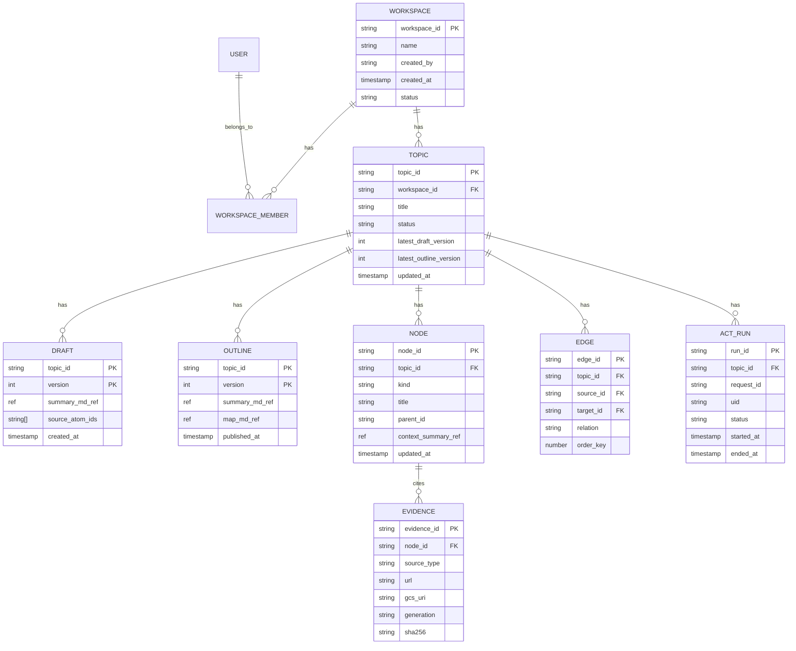
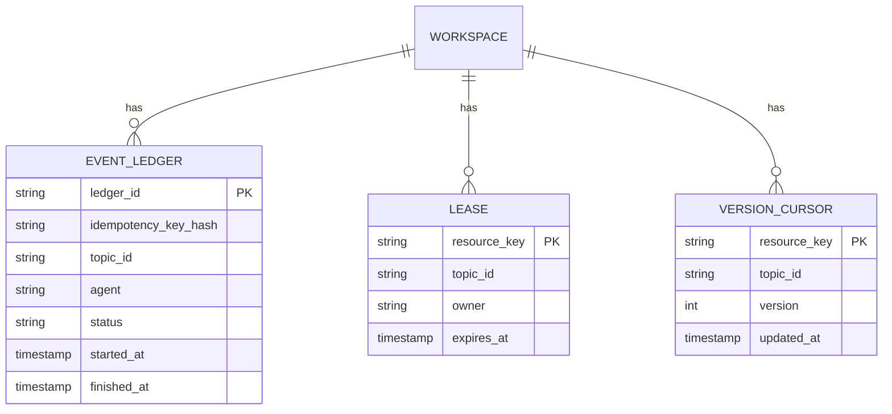

# Firestore スキーマ仕様（Topic-Centric 統合版）

目的: Topic中心モデルで、Act/Organize/Frontendが同じ正本を参照できるようにする。

## 1. スコープ

* 認証/認可に必要な workspace 境界
* topic/draft/outline/node/evidence の知識正本
* act run と event ledger/lease/version 管理

## 2. 論理ER（Core）

## 3. 論理ER（Operations）

## 4. 物理パス（推奨）

* `workspaces/{workspaceId}`
* `workspaces/{workspaceId}/members/{uid}`
* `workspaces/{workspaceId}/invites/{inviteId}`
* `workspaces/{workspaceId}/topics/{topicId}`
* `workspaces/{workspaceId}/topics/{topicId}/drafts/{version}`
* `workspaces/{workspaceId}/topics/{topicId}/outlines/{version}`
* `workspaces/{workspaceId}/topics/{topicId}/nodes/{nodeId}`
* `workspaces/{workspaceId}/topics/{topicId}/edges/{edgeId}`
* `workspaces/{workspaceId}/topics/{topicId}/nodes/{nodeId}/evidence/{evidenceId}`
* `workspaces/{workspaceId}/topics/{topicId}/actRuns/{runId}`
* `workspaces/{workspaceId}/topics/{topicId}/actRuns/{runId}/events/{seq}`
* `workspaces/{workspaceId}/eventLedger/{hash}`
* `workspaces/{workspaceId}/leases/{resourceKey}`
* `workspaces/{workspaceId}/versions/{resourceKey}`

## 5. 主要制約（MUST）

* `topic.workspace_id == request.workspace_id`
* `members/{uid}` が無ければ `PERMISSION_DENIED`
* `ACT_RUN` は `(uid, request_id)` で topic内一意
* `EDGE.source/target` は同一 topic 内に限定
* `latest_draft_version`, `latest_outline_version` は単調増加
* 本文はGCS versioned ref（`gcsUri/generation/sha256`）を保持
* Firestore は確定済みメタ/関係/権限境界/検索キーの正本とし、stream中の高頻度一時状態は保持しない
* `actRuns/events` は監査と短期再送補助のための記録に限定し、Act memory の代替にしない

## 6. トランザクション境界

* Topic参加/招待: invite消費 + member追加を同一transaction
* Draft更新: `latest_draft_version` CAS
* Outline更新: `latest_outline_version` CAS
* Bundle適用: `appliedAt` CAS
* Lease取得: `leases/{resourceKey}` compare-and-set

## 7. 監査/保持

* `actRuns/events`: TTLで短期保持
* `eventLedger`: 冪等期間に合わせて保持
* error系は `trace_id` でログ相互参照

## 8. ノート

* `tree_id` はUI表示境界として利用可
* 知識正本の主キーは `topic_id`
* 長文本文、raw observation、生成物、snapshot 実体は Firestore 本体ではなく GCS に置く
