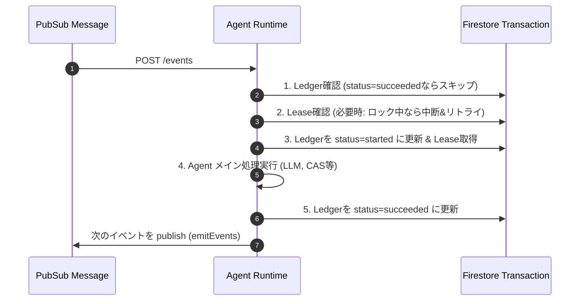

# Organize Implementation Proposal

本ドキュメントでは、`organize` ドメイン（Pub/Sub + Firestore + GCS を用いた非同期ナレッジパイプライン）の具体的な実装アーキテクチャ・技術スタック・ディレクトリ構成・および中核メカニズムの実装方針を提案します。

## 1. 技術スタックの提案

**バックエンド Runtime:** Node.js (TypeScript) + Google Cloud Run
* **理由:**
  * LLM連携（Structured Output のパース、Vertex AI SDK / Genkitの活用）が最も充実している。
  * Cloud Run の HTTP エンドポイントで Pub/Sub の Push サブスクリプションを受ける形が運用負荷が低く、スケーラブル。
  * `maxDeliveryAttempts` などのリトライ制御を Pub/Sub 側に任せられる。

**GCP サービス:**
* **Messaging:** Cloud Pub/Sub (Topic: `mind-events`, Push型 Subscription: `sub-a0` ~ `sub-a7`)
* **Database:** Firestore (Native Mode, Admin SDK 利用)
* **Storage:** Cloud Storage (GCS, `@google-cloud/storage` 利用)
* **LLM:** Vertex AI (Gemini Pro / Flash)
  * 単純な抽出/要約(A1, A7等)は Flash、複雑な Entity Resolution (A3) には Pro を併用。

## 2. リポジトリ・ディレクトリ構成案

Mono-repo の `apps/organize/` 配下に隔離されたサービスとして実装します。

```text
apps/organize/
├── package.json
├── tsconfig.json
├── src/
│   ├── index.ts              // Cloud Run (Express) エンドポイント (POST /pubsub)
│   ├── config/               // 環境変数、定数定義
│   ├── core/                 // 共通パイプライン基盤
│   │   ├── pubsub.ts         // Pub/Sub 送受信用クライアント、Envelope パース
│   │   ├── ledger.ts         // 冪等性制御 (Idempotency Key & event_ledger)
│   │   ├── lease.ts          // 排他制御 (topic/node への Lease 確保)
│   │   └── cas.ts            // バージョン照合 (Compare and Set)
│   ├── agents/               // A0〜A7 の実体
│   │   ├── a0-interpreter/
│   │   ├── a1-atomizer/
│   │   ├── a2-router/
│   │   ├── ...
│   │   └── agent-registry.ts // event type に応じて Agent をルーティング
│   ├── llm/                  // LLM (Vertex AI) 呼び出し処理とプロンプト
│   │   ├── prompts/
│   │   └── clients.ts
│   ├── repositories/         // Firestore / GCS 用の永続化層
│   │   ├── firestore/
│   │   └── gcs/
│   └── models/               // 型定義 (Zod によるスキーマバリデーション)
│       ├── envelope.ts
│       ├── topic.ts
│       └── node.ts
```

## 3. 中核メカニズムの実装仕様（Core/）

`organize/specs/pipeline/core.md` で指定された競合対策の実装アプローチです。

### 3.1. Pub/Sub Push Handler (`src/index.ts`)
Pub/Sub からの HTTP パス（例: `POST /events`）で受けます。

**処理フロー:**
1. リクエストボディの Base64 エンコードされたメッセージをデコードし、`Envelope` スキーマとしてバリデーションする
2. `envelope.type` に応じて担当する Agent を特定し、後述の `processEvent` を呼び出す
3. **成功時**: HTTP 200 を返し、Pub/Sub に ACK する
4. **CAS失敗・重複エラー時**: 定常的な競合状態であり正常処理として扱い、HTTP 200 を返して ACK する
5. **その他のエラー (500等)**: 一時的な障害として扱い、HTTP 500 等を返して Pub/Sub に再送 (NACK) させる

### 3.2. Idempotency (Event Ledger) と Lease
Firestore の **Transaction** を活用して「重複排除 (Idempotency)」と「排他制御 (Lease)」を担保します。



**トランザクション内の処理内容:**
* `event_ledger` は `hash(envelope.idempotencyKey)` をキーとして管理する。
* すでに `succeeded` の場合は `DuplicateEventError` を投げて即座に ACK する。
* Lease の取得が必要な Agent では `leases/{resourceKey}` を確認し、有効期間中であれば `LeaseAcquisitionError` を投げて NACK（リトライ）させる。
* Agent 本処理が完了したら ledger を `succeeded` に更新し、結果の event(s) を Pub/Sub に送信 (emit) する。

### 3.3. Compare And Set (CAS)
A2 による `latestDraftVersion` や A3 による `latestOutlineVersion` の更新などで利用します。

**CAS 更新フロー:**
1. トランザクション内で Firestore のターゲットドキュメント（例: `workspaces/{workspaceId}/topics/{topicId}`）を読み込む
2. ドキュメント上の現在のバージョン番号を取得する
3. 想定していた **期待するバージョン番号 (expectedVersion)** と現在のバージョン番号が一致するか検証する
4. 一致しない場合、他のプロセスが先に更新してしまったことを意味するため `StaleVersionError` を投げて処理を中断する（このエラーは Push Handler によって HTTP 200 ACK として吸収される）
5. 一致した場合のみ、現在のバージョン番号に +1 してドキュメントを更新する

## 4. 各Agentの実装ステップ（Phase分割）

一気に開発するのではなく、以下のフェーズでインクリメンタルに実装・検証することを提案します。

| Phase | 対象 Agent | 実装内容 / 検証方法 |
| ---- | ---- | ---- |
| **Phase 1: Infrastruture** | N/A | TypeScript + Express 基盤、Firestore(Ledger/Lease/CAS)、Pub/Sub(Emulate) の疎通。偽のイベントで ACK/NACK の挙動テスト。 |
| **Phase 2: Ingest** | `A0`, `A1` | URLやテキストを受け取り（A0）、LLM で事実（Atom）を抽出（A1）して GCS/Firestore に保存する動作確認。 |
| **Phase 3: Append** | `A2`, `A3b`, `A6` | Atom から Draft を生成・更新（A2）し、PipelineBundle を作る（A3b）までの経路を担保。 |
| **Phase 4: Core Engine** | `A3 Cleaner` | LLM(Gemini)を活用した Entity Resolution のプロンプトチューニング。既存 Graph と Bundle を比較し、Outline / Node / Edge の Firestore Upsert を実装。最も難易度が高い。 |
| **Phase 5: Downstream**| `A4`, `A7`, `A5` | 確定 Nodes からの Rollup HTML 生成（A7）、全文検索/Ranking特徴量の更新（A4）、メトリクスによる是正提案（A5）の追加。 |

## 5. Next Action のご提案

もしこのアーキテクチャや技術スタック（Cloud Run + Node.js/TypeScript + Gemini API）で進める場合、以下の手順で作業を着手できます。

1. `apps/organize/` の初期化と Express サーバーの立ち上げ
2. `core/` のメカニズム（Ledger/Lease 用モジュール）のテストファーストでの枠組み作成
3. A0, A1 の I/O を満たす処理を仮実装し、イベント連鎖（A0 -> Pub/Sub -> A1）のローカル実験（Pub/Sub エミュレータを利用 等）

この実装方針で良いか、または Go 等の別スタックにしたい、特定のフレームワーク（Genkit等）を使いたいなどのご要望があればお知らせください。
