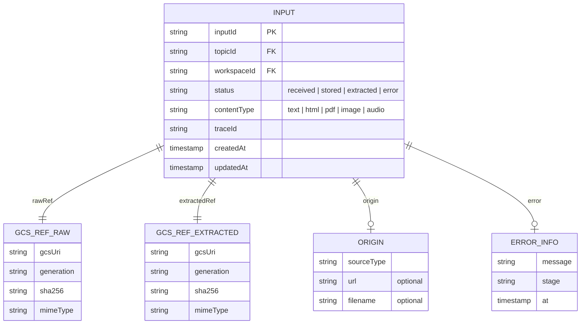

# A0 MediaInterpreterAgent 仕様

## 1. 責務

* `media.received` を受け取り、テキスト化して `input.received` を発火する
* 外部入力を抽出可能な形へ正規化し、A1 が処理できる状態にする
* evidence trace（origin + gcs ref + generation + sha256）を残す
* 詳細仕様: `organize/agents/a0/specs/ingest-extract-spec-v0.3.md`

## 2. I/O

* Input: `media.received`
* Output: `workspaces/{workspaceId}/topics/{topicId}/inputs/{inputId}`, `mind/inputs/{inputId}.md`
* Emit: `input.received`

## 3. LLM モデル

* **Gemini Flash** — テキスト抽出は速度・コスト優先。画像/PDF の OCR 時のみ利用

## 4. 処理フロー

1. `sourceType` を判定する（`web_url` / `raw_html` / `gcs_object`）
2. `sourceType` に応じた抽出パスを選択する
   * `web_url` → fetch → readability 系ライブラリでメインコンテンツ抽出 → Markdown 変換
   * `raw_html` → readability → Markdown 変換
   * `gcs_object` → MIME 判定後に分岐:
     * `text/*` → そのまま利用
     * `application/pdf` → PDF パーサーまたは Document AI
     * `image/*` → Gemini Flash Vision で OCR / 描写
     * `audio/*` → Cloud Speech-to-Text（将来対応）
3. 抽出結果を GCS に保存する: `mind/inputs/{inputId}.md`
4. Firestore `workspaces/{workspaceId}/topics/{topicId}/inputs/{inputId}` を `status: extracted` に更新する
5. `input.received` を emit する

## 5. 軽量 / 重量抽出の判定基準

| 条件 | 判定 |
| --- | --- |
| テキスト/HTML かつ 100KB 以下 | 軽量（同期処理） |
| PDF 10ページ以下 | 軽量 |
| PDF 10ページ超、画像、音声 | 重量（`extract.requested` で非同期） |
| ファイルサイズ 50MB 超 | 拒否（`INVALID_ARGUMENT`） |

## 6. 出力スキーマ: `workspaces/{workspaceId}/topics/{topicId}/inputs/{inputId}`

## 7. LLM プロンプト（画像/PDF 抽出時のみ）

> あなたはドキュメント変換専門家です。以下の画像/PDFページの内容を、構造を保持したMarkdownとして書き起こしてください。
>
> ルール:
> - 見出し階層を保持する
> - 表はMarkdown表形式にする
> - 図表は `[図: 説明]` として記述する
> - 原文にない情報を追加しない

## 8. Idempotency / 競合対策

* ledger: `type:media.received/inputId:{inputId}`
* 同一 `rawRef.sha256` で `extractedRef` 既存なら skip
* heavy 側: 同一 `inputId` で hash 一致かつ extracted なら skip
* 再試行時も GCS は新規 version のみ（上書き禁止）

## 9. 状態遷移

* `received → stored → extracted`
* 任意状態から `error` へ遷移可能
* `error.stage` を必須保存
