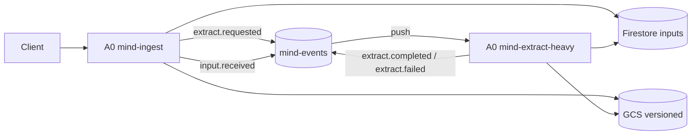

# A0 MediaInterpreter Ingest/Extract 仕様（Mind v0.3）

Version: v0.3-draft-2  
Owner: A0

## 0. 位置づけ

* 本仕様は A0 MediaInterpreter の実行仕様。
* A1 Atomizer は本仕様の出力契約のみ利用する（実装仕様は別）。

## 1. 目的

* 外部入力を抽出可能な形へ正規化し、A1が処理できる状態にする。
* evidence trace（origin + gcs ref + generation + sha256）を必ず残す。

## 2. 不変条件（MUST）

1. GCS append-only/versioned
2. Pub/Sub at-least-once 前提
3. Firestoreは状態と参照のみ保持
4. sha256/generation/state で冪等化
5. `/tmp` 以外へローカル書き込みしない

## 3. A0の責務

1. `POST /ingest` 入力の受理
2. raw の永続化（必要時）
3. 軽抽出（HTML中心）または heavy回送
4. 抽出結果参照を Firestore 更新
5. `input.received` を publish（A1起動）

## 4. アーキテクチャ



## 5. 入力API（A0）

`POST /ingest`

```json
{
  "sourceType": "web_url | raw_html | gcs_object",
  "payload": {"url":"...", "html":"...", "gcsUri":"gs://..."},
  "hint": {"mime":"...", "mode":"...", "prefer":"light|heavy"},
  "origin": {"sourceType":"web|slack|chat|gcs", "urlOrRef":"..."}
}
```

## 6. イベント設計（mind-events）

A0が使うtype:

* `extract.requested`
* `extract.completed`
* `extract.failed`
* `input.received`（A1連携）

`extract.requested` 必須本文:

```json
{
  "type": "extract.requested",
  "traceId": "t_xxx",
  "inputId": "in_xxx",
  "source": {
    "gcsUri": "gs://bucket/path/file.pdf",
    "generation": "1719...",
    "sha256": "..."
  },
  "hint": {"mime": "application/pdf", "mode": "pdf_ocr"},
  "origin": {"sourceType":"...","urlOrRef":"..."},
  "createdAt": "RFC3339",
  "attempt": 1
}
```

## 7. Firestoreスキーマ（A0管理）

`inputs/{inputId}`:

```json
{
  "status": "received|stored|extracted|error",
  "contentType": "text|html|pdf|docx|image|media_text",
  "rawRef": {"gcsUri":"...","generation":"...","sha256":"...","mimeType":"..."},
  "extractedRef": {"gcsUri":"...","generation":"...","sha256":"...","mimeType":"text/plain"},
  "traceId": "t_xxx",
  "origin": {"sourceType":"...","urlOrRef":"..."},
  "error": {"message":"...","at":"RFC3339","stage":"ingest|heavy"}
}
```

## 8. 冪等仕様（A0）

* ingest側: 同一 `rawRef.sha256` で既存 `extractedRef` があれば skip
* heavy側: 同一 `inputId` で `status=extracted` かつ hash一致なら skip
* 再試行時も GCS 新規versionのみ作成（上書き禁止）

## 9. 状態遷移

* `received -> stored -> extracted`
* 任意状態から `error` へ遷移可能
* `error` には `stage` を必須保存

## 10. A1連携契約

A0は抽出完了時に `input.received` を publish する。
A1は `inputs/{inputId}.extractedRef` を読んで Atom化を開始する。

## 11. 非スコープ

* A1の分割アルゴリズム本体
* Bundler/Cleaner/Indexer
* 実装言語固有コード（Python/FastAPI）

## 12. 不確実点

* Slack deep link 正規化形式
* `inputs` 重複判定インデックス設計
* heavy判定ルールの閾値（mime, size, page数）
