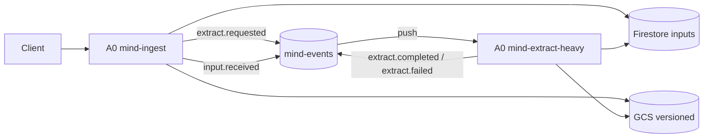

# A0 MediaInterpreter Ingest/Extract 仕様（topic-centric v0.3）

Version: v0.3-draft-3  
Owner: A0

## 位置づけ

* 本仕様は A0 MediaInterpreter の実行仕様。
* A1 Atomizer は本仕様の出力契約のみ利用する（実装仕様は別）。
* `mind-events` はイベントバス名、`mind/` は GCS 接頭辞としてのみ扱う。

## 目的

* 外部入力を抽出可能な形へ正規化し、A1が処理できる状態にする。
* evidence trace（origin + gcs ref + generation + sha256）を残す。

## 不変条件（MUST）

1. GCS append-only/versioned
2. Pub/Sub at-least-once 前提
3. Firestoreは状態と参照のみ保持
4. sha256/generation/state で冪等化
5. `/tmp` 以外へローカル書き込みしない

## A0の責務

1. `POST /ingest` 入力受理
2. raw の永続化（必要時）
3. 軽抽出（HTML中心）または heavy回送
4. 抽出結果参照を Firestore 更新
5. `input.received` を publish（A1起動）

## アーキテクチャ

## 入力API（A0）

### `POST /ingest` 最小フィールド

| フィールド | 必須 | 説明 |
| --- | --- | --- |
| `sourceType` | 必須 | `web_url`, `raw_html`, `gcs_object` |
| `payload` | 必須 | url/html/gcsUri のいずれか |
| `hint` | 任意 | mime/mode/prefer(light|heavy) |
| `origin` | 任意 | sourceType/urlOrRef など証跡 |

## イベント設計（mind-events）

A0が使う type:

* `extract.requested`
* `extract.completed`
* `extract.failed`
* `input.received`（A1連携）

### `extract.requested` 必須フィールド

| フィールド | 必須 | 説明 |
| --- | --- | --- |
| `type` | 必須 | `extract.requested` |
| `traceId` | 必須 | トレースキー |
| `inputId` | 必須 | 入力識別子 |
| `source.gcsUri` | 必須 | 元データGCS URI |
| `source.generation` | 必須 | GCS世代 |
| `source.sha256` | 必須 | 元データハッシュ |
| `hint.mime` | 推奨 | mime型 |
| `hint.mode` | 推奨 | 抽出モード |
| `origin` | 推奨 | 起点情報 |
| `createdAt` | 必須 | RFC3339 |
| `attempt` | 必須 | 再試行回数 |

## Firestoreスキーマ（A0管理）

`inputs/{inputId}`:

| フィールド | 説明 |
| --- | --- |
| `status` | `received|stored|extracted|error` |
| `contentType` | `text|html|pdf|docx|image|media_text` |
| `rawRef` | gcsUri/generation/sha256/mimeType |
| `extractedRef` | gcsUri/generation/sha256/mimeType |
| `traceId` | トレースキー |
| `origin` | 起点情報 |
| `error` | message/at/stage |

## 冪等仕様

* ingest側: 同一 `rawRef.sha256` で `extractedRef` 既存なら skip
* heavy側: 同一 `inputId` で hash一致かつ extractedなら skip
* 再試行時も GCS は新規versionのみ（上書き禁止）

## 状態遷移

* `received -> stored -> extracted`
* 任意状態から `error` へ遷移可能
* `error.stage` を必須保存

## A1連携契約

A0は抽出完了時に `input.received` を publishする。A1は `inputs/{inputId}.extractedRef` を読んでAtom化を開始する。

## 非スコープ

* A1分割アルゴリズム本体
* Bundler/Cleaner/Indexer
* 実装言語固有コード

## 不確実点

* Slack deep link 正規化形式
* `inputs` 重複判定インデックス設計
* heavy判定閾値（mime/size/page数）
