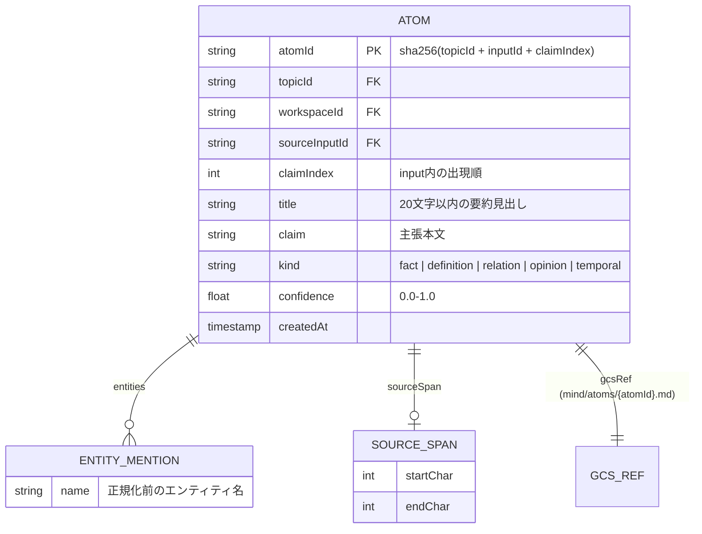

# A1 AtomizerAgent 仕様

## 1. 責務

* `input.received` から Atom（事実の最小単位）を抽出して `atom.created` を発火する
* A0 との境界契約: `organize/agents/a1/specs/a0-a1-boundary.md`

## 2. I/O

* Input: `input.received`
* Output: `workspaces/{workspaceId}/topics/{topicId}/atoms/{atomId}`, `mind/atoms/{atomId}.md`
* Emit: `atom.created`

## 3. LLM モデル

* **Gemini Flash** — 構造化抽出。Structured Output で JSON 確定

## 4. Atom の定義と粒度ルール

Atom は「**単一の出典から導出できる、1つの主張・事実・定義**」とする。

| ルール | 基準 |
| --- | --- |
| 粒度 | 1 Atom = 1 claim（「AはBである」「XはYに影響する」等） |
| 最大長 | 1 Atom あたり 500 トークン以下 |
| 最小長 | 意味のある主張として成立すること |
| 分割基準 | 異なる事実・異なるエンティティへの言及は別 Atom にする |
| 結合禁止 | 複数の独立した事実を1 Atom にまとめない |

## 5. 出力スキーマ: `workspaces/{workspaceId}/topics/{topicId}/atoms/{atomId}`

* `atomId` は `sha256(topicId + sourceInputId + claimIndex)` で決定論的に生成する
* 同一 `sourceInputId` からの再抽出時は `claimIndex` の一致で重複判定し、既存 Atom を上書きしない

## 6. kind の分類基準

| kind | 判定基準 | 例 |
| --- | --- | --- |
| `fact` | 検証可能な事実の記述 | 「東京タワーの高さは333mである」 |
| `definition` | 用語・概念の定義 | 「トランザクションとは〜を指す」 |
| `relation` | エンティティ間の関係を記述 | 「AはBに依存している」 |
| `opinion` | 主観的な評価・見解 | 「この設計は複雑すぎる」 |
| `temporal` | 時系列に依存する事実 | 「2024年にリリースされた」 |

## 7. confidence の付与基準

| 確信度 | 条件 |
| --- | --- |
| 0.9 - 1.0 | 明確な事実記述。出典が明確で検証可能 |
| 0.7 - 0.9 | 一般に受け入れられている知識 |
| 0.5 - 0.7 | 文脈依存の判断や限定的な主張 |
| 0.3 - 0.5 | 推測・意見・条件付きの主張 |
| 0.1 - 0.3 | 曖昧・情報不足・矛盾の可能性あり |

## 8. LLM プロンプト（Structured Output）

> あなたは情報分析の専門家です。以下のテキストから、個別の事実・主張・定義を「Atom」として抽出してください。
>
> **入力テキスト:** {extractedText}
>
> **各Atomの出力フィールド:**
> - `title`: 20文字以内の要約見出し
> - `claim`: 主張の全文（原文に忠実に、ただし文脈が分かるよう最小限の補足可）
> - `kind`: `fact` / `definition` / `relation` / `opinion` / `temporal`
> - `entities`: 言及されているエンティティ名の配列
> - `confidence`: この主張の確実性 (0.0〜1.0)
>
> **ルール:**
> - 1つのAtomに複数の独立した事実を含めない
> - 原文にない推測を追加しない
> - 同じ事実の言い換えは1つにまとめる
> - 文脈なしでも理解できるよう、必要最小限の背景情報を含める

## 9. Idempotency / 競合対策

* ledger: `type:input.received/inputId:{inputId}`
* 同一 input の二重生成防止（`sourceInputId` + deterministic `atomId`）

## 10. `atom.reissued` 受信時の処理

* `atom.reissued` を受信した場合は、元の atom のテキストを再抽出する
* payload の `reissueCount` をインクリメントして引き継ぐ
* `reissueCount >= 3` の場合は再抽出せず、強制 REJECT としてログ記録のみ行う
* `previousReason` を LLM の追加コンテキストとして注入し、前回の判定理由を考慮した抽出を試みる
