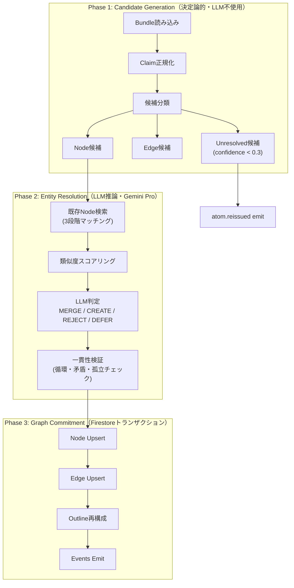
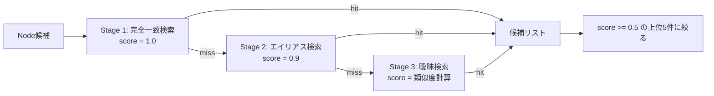
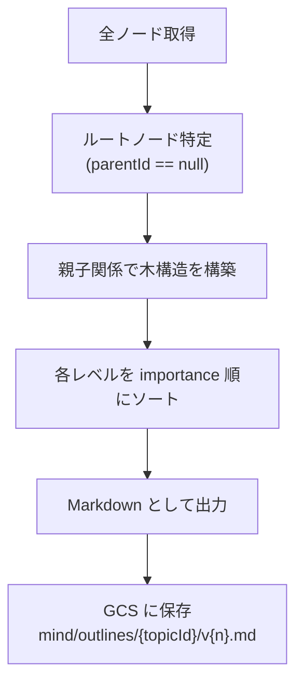

# A3 CleanerAgent 仕様

## 1. 責務

* `bundle.created` を受け取り、PipelineBundle の提案を既存ナレッジグラフに統合する
* **パイプライン全体の頭脳**。Entity Resolution（名寄せ）、矛盾解決、グラフの一貫性維持を担う

## 2. I/O

* Input: `bundle.created`（`topic.schema_updated` も参照可能）
* Output: `topics/{topicId}/outlines/{outlineVersion}`, `topics/{topicId}/nodes/*`, `topics/{topicId}/edges/*`
* Emit: `outline.updated`, `topic.node_changed`, `atom.reissued`

## 3. LLM モデル

* **Gemini Pro** — Entity Resolution には深い推論が必要。パイプラインで唯一 Pro を使用

## 4. なぜ難しいのか

1. **同一性の判定が曖昧**: 「東京タワー」と「Tokyo Tower」は同じか？「トランプ」は人名かカードゲームか？
2. **矛盾の解決**: 既存ノードの情報と新しい claim が矛盾する場合の優先順位
3. **グラフの構造的一貫性**: merge によって壊れる edge の修復
4. **不可逆操作のリスク**: 誤った merge は取り消しが困難

## 5. 処理アーキテクチャ: 3フェーズ分離

---

### Phase 1: Candidate Generation（決定論的）

この段階では LLM を使わない。Bundle の claim を走査して3種類に分類する。

| 候補タイプ | 条件 | 処理 |
| --- | --- | --- |
| Node候補 | claim のエンティティが主語である | エンティティ名を正規化し、Phase 2 に渡す |
| Edge候補 | `kind = relation` の claim | ソース・ターゲットの hint を抽出する |
| Unresolved候補 | `confidence < 0.3`、または schema 不整合 | 直接 `atom.reissued` で差し戻す |

各 Node 候補に対して、Phase 2 で使うための「既存ノード検索」を事前実行する。

---

### Phase 2: Entity Resolution（最重要）

#### Step 2a: 既存ノード検索 — 3段階マッチング

候補の `normalizedTitle` を以下の3段階で既存ノードと照合する。

| Stage | 検索方法 | スコア |
| --- | --- | --- |
| 1. 完全一致 | `normalizedTitle` の厳密一致（大文字小文字・全角半角の正規化後） | 1.0 |
| 2. エイリアス | 過去の merge で記録されたエンティティの別名（aliases）で検索 | 0.9 |
| 3. 曖昧検索 | 編集距離（Levenshtein）＋ トークン重複率で類似度を計算 | 計算値（0.0〜1.0） |

スコア 0.5 未満の候補は棄却し、上位 **5件** に絞って Step 2b に渡す。

#### Step 2b: LLM によるマージ判定

A3 の心臓部。LLM に「判定 + 理由」を必ず出力させ、**トレーサビリティを確保**する。

**判定の4択:**

| 判定 | 条件 | 動作 |
| --- | --- | --- |
| **MERGE** | 同一エンティティへの追加情報。表記揺れ・略称・翻訳を含む。矛盾があっても時系列で説明できる | 既存ノードに情報を統合する |
| **CREATE** | 名前が似ていても指すものが明確に異なる。完全に新しいトピック・概念 | 新しいノードを作成する |
| **REJECT** | 主張が曖昧すぎてノード化できない。確信度が極めて低く裏付けもない | 破棄する（ログのみ） |
| **DEFER** | 判断に十分な情報がない。追加コンテキストがあれば判断できる可能性がある | `atom.reissued` として再評価キューに戻す |

**LLM プロンプト:**

> あなたはナレッジグラフの専門家です。新しい情報（Claim）を既存のノードに統合するか、新規ノードを作成するかを判定してください。
>
> **新しい Claim:**
> - タイトル: {normalizedTitle}
> - 内容: {normalizedClaim}
> - 種類: {kind}
> - 確信度: {confidence}
> - 言及エンティティ: {entities}
>
> **既存ノード候補（類似度順）:**
> 候補1: {title} (score: {score})
> - Kind: {kind}, 現在の要約: {contextSummary}, 関連エッジ: {edges}
> （最大5件）
>
> **判定ルール:**
> 1. **MERGE** — 同一エンティティへの追加情報である場合
> 2. **CREATE** — 名前が似ていても指すものが明確に異なる場合
> 3. **REJECT** — ノイズや不十分な情報の場合
> 4. **DEFER** — 判断に十分な情報がない場合
>
> **出力:** `decision`, `targetNodeId`（MERGEの場合）, `reason`（2-3文）, `confidence`（0.0-1.0）, `mergeStrategy`（MERGEの場合: `append` / `update` / `supersede`）

**Merge 戦略の詳細:**

| 戦略 | 適用条件 | 動作 |
| --- | --- | --- |
| `append` | 新情報が既存情報の補足 | `contextSummary` に追記、`evidence` を追加 |
| `update` | 既存情報の更新・修正 | `contextSummary` を LLM で再合成 |
| `supersede` | 既存情報が古く、新情報で完全上書き | `contextSummary` を新情報で置換、旧情報を evidence に退避 |

#### Step 2c: 判定結果の一貫性検証

LLM の判定結果を鵜呑みにせず、以下の自動チェックを通す。

| チェック項目 | 検出条件 | 対処 |
| --- | --- | --- |
| **循環参照** | merge の連鎖がループを形成する（A→B→C→A） | 関連する判定を全て DEFER に格下げ |
| **矛盾マージ** | 同一ノードに対して互いに矛盾する claim が merge される | 確信度の低い方を DEFER に変更 |
| **孤立エッジ** | Edge の参照先ノードが REJECT された | Edge も REJECT するか、参照先を DEFER に変更 |

---

### Phase 3: Graph Commitment（トランザクション）

全ての判定が確定した後、Firestore トランザクション内で一括適用する。

**処理順序:**

1. **Outline version CAS** — `latestOutlineVersion` が想定通りか確認する。不一致なら中断（正常競合吸収）
2. **Node Upsert** — MERGE 判定のノードは既存ドキュメントを更新、CREATE 判定は新規ドキュメント作成
3. **Edge Upsert** — 確定した関係を `topics/{topicId}/edges/{edgeId}` に書き込む
4. **Outline 再構成** — 下記アルゴリズムで再構成する
5. **Events Emit** — `outline.updated`、変更 node ごとに `topic.node_changed`、DEFER 分は `atom.reissued`

### Outline 再構成アルゴリズム

1. `parentId` が null のルートノードを特定する
2. 親子関係をたどって木構造を構築する
3. 同じ階層内のノードは `importance` 順にソートする
4. 見出し階層付きの Markdown として出力する
5. GCS に保存し、Firestore の `latestOutlineVersion` を進める

## 6. `atom.reissued` の発火条件一覧

| 条件 | 処理 |
| --- | --- |
| LLM 判定が `DEFER` | `atom.reissued` で再評価キューへ |
| LLM の判定 confidence < 0.4 | `atom.reissued` で再評価キューへ |
| 一貫性検証でエラー検出 | 関連する全 claim を `atom.reissued` |
| schema 不整合 | 該当 claim を `atom.reissued` |
| LLM 呼び出しがタイムアウト等で失敗 | Agent 全体を NACK（Pub/Sub のリトライに委ねる） |

## 7. 判定責務（再掲）

* 新規 node を作るか、既存 node に merge するかを決める
* 親子関係にするか、関連 relation にするかを決める
* outline に昇格できる確度かを決める
* current schema で表現不能なら再評価に戻す
* 変更 downstream が必要な node を選ぶ

## 8. Schema 適用責務

* 適用時点の `schema_version` を解決して node / edge / index 生成に使う
* schema と不整合な候補は `atom.reissued` で再評価へ戻せる
* 生成した node / edge は使用した `schema_version` を辿れるようにする

## 9. Idempotency / 競合対策

* ledger: `type:bundle.created/bundleId:{bundleId}/purpose:apply`
* lease: `topic:{topicId}`
* bundle 二重適用防止（`appliedAt` CAS）
* outlineVersion CAS
