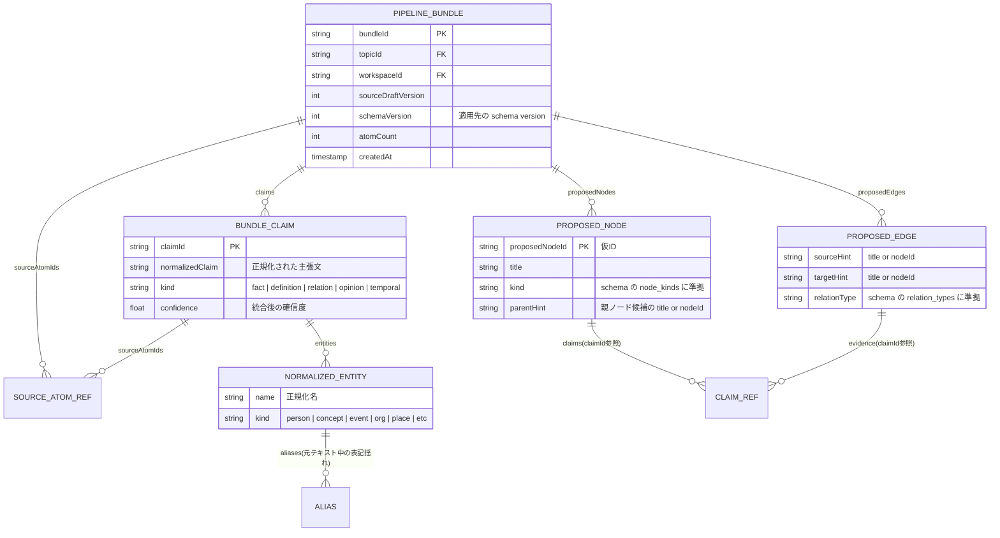

# A3b BundlerAgent 仕様

## 1. 責務

* `draft.updated` 差分から `PipelineBundle` を作り `bundle.created` を発火する
* Draft の「生の追記」を「構造化された変更提案」に蒸留するのが責務

## 2. I/O

* Input: `draft.updated`
* Output: `workspaces/{workspaceId}/topics/{topicId}/pipelineBundles/{bundleId}`, `workspaces/{workspaceId}/topics/{topicId}/schemas/{version}`（必要時）
* Emit: `bundle.created`, `topic.schema_updated`（必要時）

## 3. LLM モデル

* **Gemini Flash** — Draft 差分の要約・構造化。定型処理

## 4. PipelineBundle スキーマ

## 5. LLM プロンプト

> あなたはナレッジグラフの設計者です。以下のDraft差分（新規追加されたAtom群）を分析し、構造化された変更提案を生成してください。
>
> **現在の Topic Schema (version: {schemaVersion})**
> - Node Kinds: {nodeKinds}
> - Relation Types: {relationTypes}
>
> **既存の Outline（参考）:** {currentOutlineSummary}
>
> **新規 Atom 群:** {newAtoms}
>
> **タスク:**
> 1. 重複・矛盾する Atom を統合し、`normalizedClaim` として出力する
> 2. 各 claim からノード候補とエッジ候補を提案する
> 3. エンティティ名を正規化する（表記揺れの統合）
> 4. 既存 Outline との関連を `parentHint` として示す
>
> **スキーマ不足の報告:** 現在の schema で表現できない node kind や relation type があれば、`schemaExtension` フィールドで報告する。

## 6. Bundle 分割基準

* 1 Bundle あたり最大 **30 claims**
* 30 claims を超える場合はエンティティをクラスタリングして分割する
* 分割時は依存関係のある claim を同一 Bundle にまとめる

## 7. Schema 進化の発火条件

1. LLM が `schemaExtension`（新しい node kind / relation type の提案）を返した場合に評価する
2. 既存 schema に追加可能（後方互換）→ `schema_version` を +1 し `topic.schema_updated` を emit する
3. 追加不可（破壊的変更）→ 既存 kind に最も近いものにフォールバックする

## 8. Idempotency / 競合対策

* ledger: `type:draft.updated/topicId:{topicId}/draftVersion:{draftVersion}`
* 推奨 lease: `topic:{topicId}`
* 同一 `(topicId, draftVersion)` の重複 bundle を禁止
* schema 更新時は `workspaces/{workspaceId}/topics/{topicId}.schema_version` を CAS で進める
