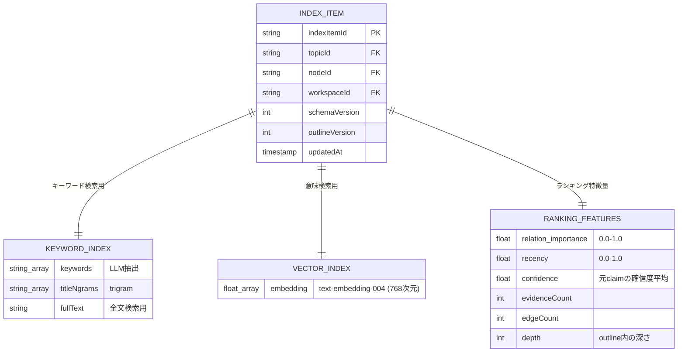

# A4 IndexerAgent 仕様

## 1. 責務

* `outline.updated` から Index / Map を再構成する
* 検索とランキングの基盤を提供する

## 2. I/O

* Input: `outline.updated`
* Output: `workspaces/{wid}/topics/{tid}/indexItems/*`, `mind/maps/{topicId}/v{n}.md` (GCS), `workspaces/{wid}/topics/{tid}` (latestMapVersion更新)
* Emit: なし（任意）

## 3. LLM モデル

* **Gemini Flash + text-embedding-004** — キーワード抽出（Flash）と ベクトル生成（Embedding モデル）

## 4. インデックス戦略: ハイブリッド（keyword + vector）

## 5. 特徴量の算出式

### relation_importance（重要度）

| 要素 | 重み | 算出方法 |
| --- | --- | --- |
| エッジ数 | 30% | 全ノード中での正規化 (0-1) |
| 根拠数 | 30% | 全ノード中での正規化 (0-1) |
| 深さの逆数 | 20% | `1 / (depth + 1)` |
| 確信度 | 20% | claim の confidence 平均 |

### recency（鮮度）

指数減衰関数を適用する: `exp(-0.05 × 最終更新からの日数)`

### ranking_score（総合スコア）

| 要素 | 重み |
| --- | --- |
| relation_importance | 40% |
| relevance（クエリとの関連度） | 30% |
| recency | 20% |
| confidence | 10% |

## 6. 更新戦略: 差分更新

1. `outline.updated` イベントから `topicId` を取得する
2. 同時に emit された `topic.node_changed` から `changedNodeIds` を把握する
3. 変更があった node の `index_items` のみ再計算する
4. 全ノードの `importance` の正規化は定期バッチ（A5 連携）で再実行する
5. topic Map（`mind/maps/{topicId}/v{n}.md`）は全ノードを含む俯瞰図なので全量再生成する

## 7. Idempotency / 競合対策

* ledger: `type:outline.updated/topicId:{topicId}/outlineVersion:{outlineVersion}`
* lease: `topic:{topicId}`
* 古い版は skip + ACK
