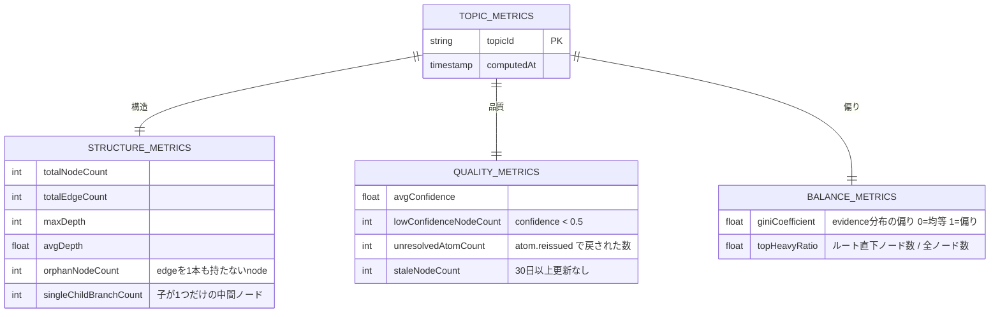

# A5 BalancerAgent 仕様

## 1. 責務

* `topic.metrics.updated` を受けてナレッジグラフの品質メトリクスを監視し、構造的な偏りを検出・是正する

## 2. I/O

* Input: `topic.metrics.updated`（または定期実行）
* Output: `organizeOps/{opId}`
* Emit: `topic.node_changed`, `topic.metrics.updated`

## 3. LLM モデル

* **LLM 不使用** — メトリクス計算は純粋なロジック

## 4. メトリクス定義

## 5. 是正ルール

| メトリクス | 閾値 | アクション |
| --- | --- | --- |
| `orphanNodeCount > 0` | 常時 | `topic.node_changed` emit（rollup 再生成でエッジ候補を再提案） |
| `giniCoefficient > 0.7` | 偏りあり | `organizeOps/{opId}` に「evidence 再分配推奨」を記録 |
| `topHeavyRatio > 0.5` | フラットすぎる | 階層化の提案を `organizeOps` に記録 |
| `avgConfidence < 0.4` | 品質低 | 低確信ノードの再検証を `organizeOps` に記録 |
| `unresolvedAtomCount > 20` | 滞留 | アラート（人手介入推奨） |
| `staleNodeCount / totalNodeCount > 0.5` | 陳腐化 | `node.rollup_requested` で再要約 |

## 6. 実行トリガー

* イベント駆動: A4 が index 更新完了後に `topic.metrics.updated` を emit した時
* 定期実行: 1日1回の cron（Cloud Scheduler → Pub/Sub）
* MVP: イベント駆動のみ。定期実行は Phase 5 以降

## 7. Idempotency / 競合対策

* 変更適用時 lease 推奨（outline or scopeNode）
* generation CAS 推奨
