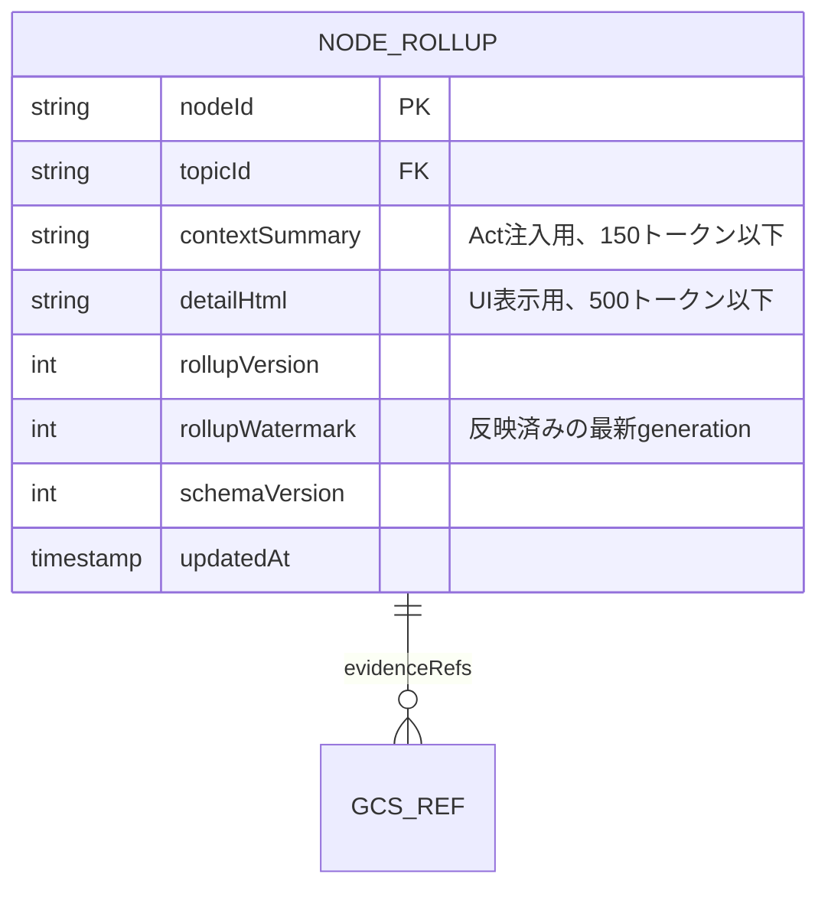

# A7 NodeRollupAgent 仕様

## 1. 責務

* `topic.node_changed` / `node.rollup_requested` でノード要約を更新する
* Act の Context Assembly が `context_summary_ref` として参照する最重要の供給物を生成する

## 2. I/O

* Input: `topic.node_changed` or `node.rollup_requested`
* Output: `mind/node_rollup/{nodeId}/v{n}.html`, `workspaces/{workspaceId}/topics/{topicId}/nodes/{nodeId}.rollupRef`, `rollupWatermark`
* Emit: `node.rollup_updated`（任意）

## 3. LLM モデル

* **Gemini Flash** — ノード要約。コンテキスト長に注意

## 4. Rollup スキーマ

## 5. 2種類の出力の使い分け

| 出力 | 用途 | 制約 |
| --- | --- | --- |
| `contextSummary` | Act Context Assembly が LLM プロンプトに注入する | 150 トークン以下。このノードが何か・なぜ重要かを1-2文。他ノードとの関係を最低1つ含む |
| `detailHtml` | フロントエンドの UI でノード詳細として表示する | 500 トークン以下。見出し・箇条書き・ハイライト使用可。根拠へのリンクを含む |

## 6. LLM プロンプト

> 以下のノード情報を2種類の要約にまとめてください。
>
> **ノード情報:**
> - タイトル: {title}, 種類: {kind}
> - 関連Claim群: {relatedClaims}
> - 子ノード: {childNodes}
> - 関連エッジ: {edges}
> - 根拠: {evidences}
>
> **出力1: contextSummary（Act注入用）** — 150トークン以下。このノードが何であるか、なぜ重要かを1-2文で。他のノードとの関係を最低1つ含める。
>
> **出力2: detailHtml（UI表示用）** — HTML形式、500トークン以下。見出し・箇条書き・ハイライトを活用。根拠へのリンクを含める。

## 7. Watermark メカニズム

* `rollupWatermark` は、この rollup が反映済みの最新 `generation` を表す
* 受信した `topic.node_changed` の generation が `rollupWatermark` 以下 → **skip + ACK**（古い通知）
* generation が `rollupWatermark` 超 → 処理実行し、watermark を更新する

## 8. 子ノード集約ルール

| 条件 | 処理 |
| --- | --- |
| 直接の子ノードが 5 件以下 | 全ての子の `contextSummary` を含める |
| 直接の子ノードが 5 件超 | `importance` 上位 5 件の要約 + 「他 N 件」表記 |
| 孫以降 | 含めない（フラット化しない） |

## 9. Idempotency / 競合対策

* ledger: `type:topic.node_changed/nodeId:{nodeId}/generation:{gen}` 推奨
* lease: `node:{nodeId}`
* watermark 以下の古い要求は skip + ACK
