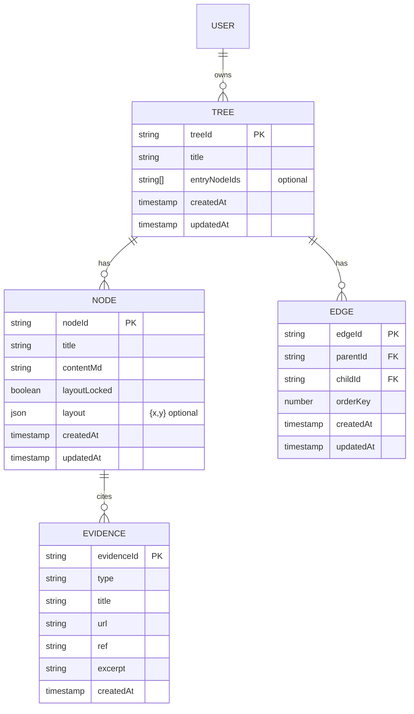
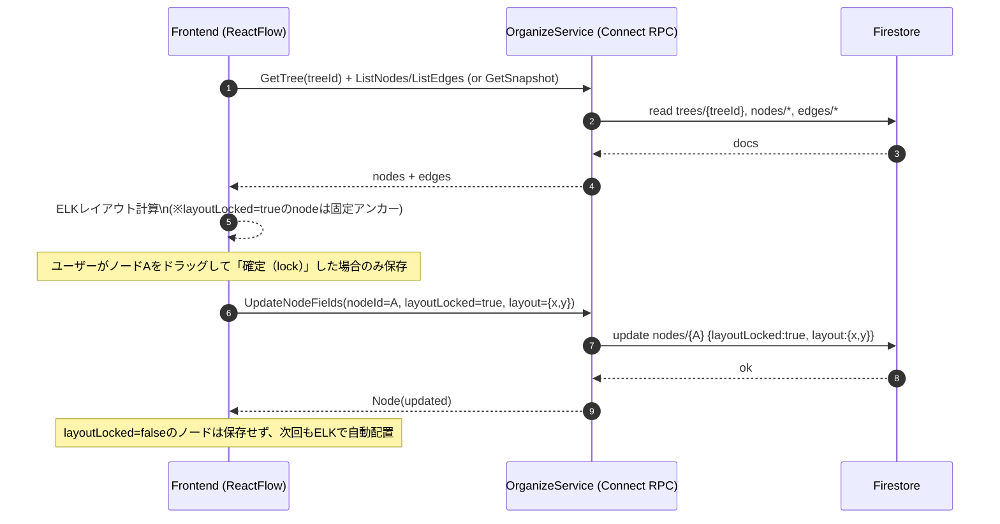

# RPC/Firestore スキーマ仕様（edge方式）

* `users/{uid}/trees/{treeId}`
* `users/{uid}/trees/{treeId}/nodes/{nodeId}`
* `users/{uid}/trees/{treeId}/edges/{edgeId}`
* `users/{uid}/trees/{treeId}/nodes/{nodeId}/evidence/{evidenceId}`

### trees/{treeId}

* `title: string`
* `entryNodeIds: string[]`（任意：入口を固定したいなら。無ければ「親がいないnodeがroot扱い」でもOK）
* `createdAt`, `updatedAt`

### nodes/{nodeId}

* `title: string`
* `contentMd: string`
* `layoutLocked: boolean`（true のノードだけ手動配置）
* `layout?: {x:number,y:number}`（**layoutLocked=true の時だけ保存**）
* `createdAt`, `updatedAt`

### edges/{edgeId}

* `parentId: string`
* `childId: string`
* `orderKey: number`（同一parent配下の並び。ギャップ運用）
* `createdAt`, `updatedAt`

> ✅ `tags` / `relatedNodeIds` は削除
> ✅ `parentId` は node から消して **edgeで複数親を表現**
> ✅ `childrenIds` は保持しない（必要なら edge をクエリして導出）

---

## Mermaid：ER（更新版）



---

## Mermaid：Firestoreのパス構造（uid配下も明示）

```mermaid
flowchart TB
  U[users/{uid}] --> T[trees/{treeId}]
  T --> N[nodes/{nodeId}]
  T --> E[edges/{edgeId}]
  N --> EV[evidence/{evidenceId}]
```

---

## Mermaid：layout “触ったノードだけ保存” の流れ（更新版）



---

## 共有RPCスキーマ（Proto）

フロントとバックエンドの共有型・RPC定義は以下を参照。

* `rpc/specs/proto-contracts.md`
