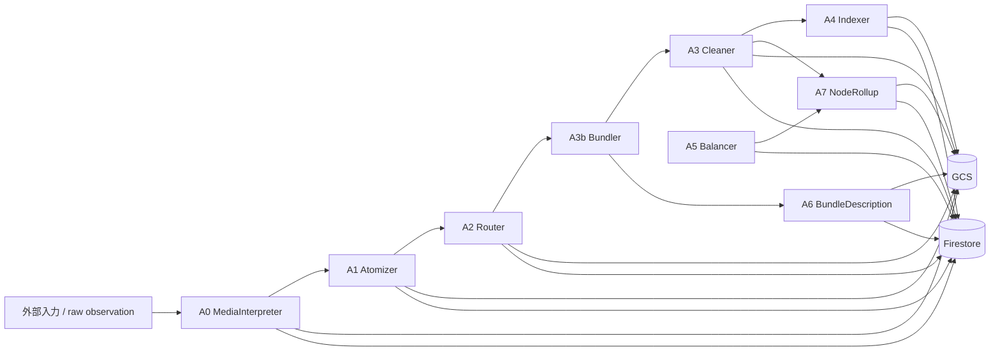
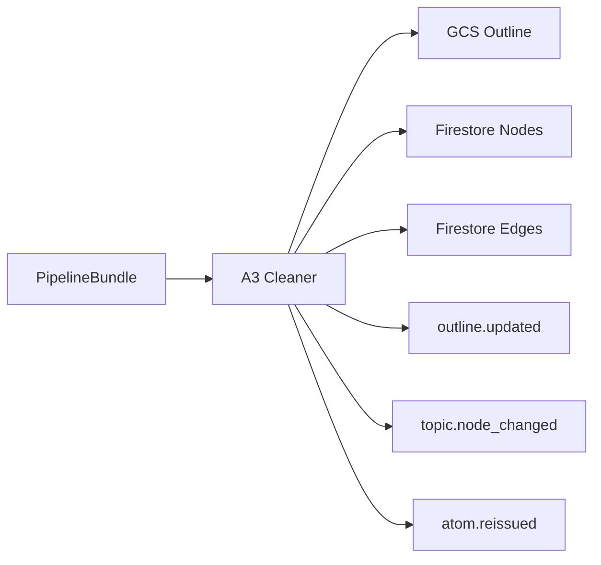
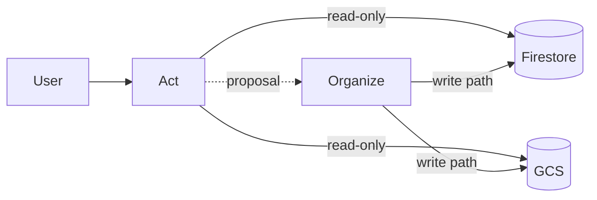
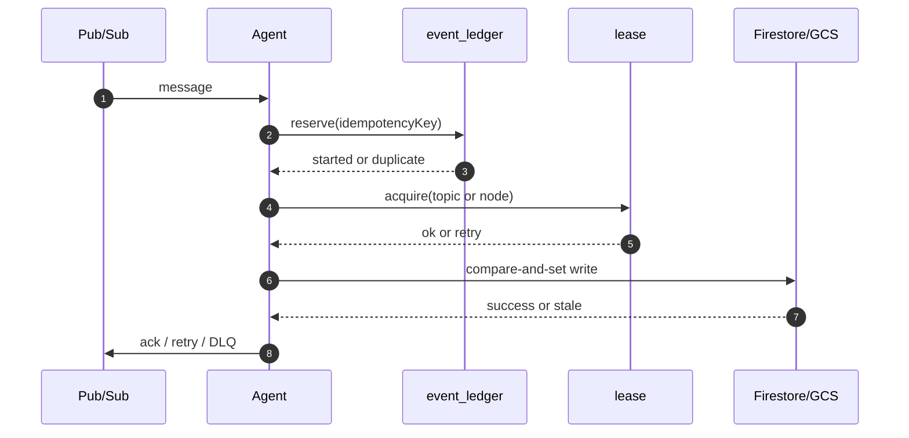

# Organize Guide（Human View）

## Organize は何をするか

`Organize` は、外部入力や Act で得た知見をそのまま捨てず、あとで再利用できる知識正本へ変換する write path である。

役割を一言で言うと、

* バラバラの入力を topic 単位の知識へ整理する
* 確定済みのノード、エッジ、要約、索引を更新する
* Act が読むための安定した材料を Firestore/GCS に供給する

`Act` が「今この場の探索」を担当するのに対して、`Organize` は「後で何度も使える形への定着」を担当する。

## Organize がしないこと

* ユーザーへの stream 応答を返さない
* Firestore/GCS を read するだけの query layer にはならない
* Act の `PromptBundle` を生成しない
* 実行中の ephemeral memory を保持しない

## どこに何を書くか

* Firestore:
  * topic, node, edge, version, index, evidence ref のような確定済み軽量メタ
* GCS:
  * 本文、draft、outline、map、rollup、bundle description のような重い実体
* Pub/Sub:
  * 各 Agent をつなぐ非同期イベント



## 全体像

`Organize` は 1 本のイベントバス `mind-events` を中心に動く。  
ただし `mind-events` はインフラ名であり、知識モデル名ではない。知識モデルの正本用語は `topic`, `node`, `edge` である。

```mermaid
flowchart TD
  E[Event Bus<br>mind-events] --> A0[A0]
  E --> A1[A1]
  E --> A2[A2]
  E --> A3B[A3b]
  E --> A3[A3]
  E --> A4[A4]
  E --> A5[A5]
  E --> A6[A6]
  E --> A7[A7]

  A3 --> T[Topic Graph<br>topics/{topicId}/nodes, edges]
  A4 --> I[Index Items]
  A7 --> R[Node Rollup]
```

## 処理の順番

### 1. A0 MediaInterpreter

入力を受け取って、raw/extracted な実体を保存する入口。

* 受けるもの:
  * URL, HTML, GCS object など
* やること:
  * 入力を正規化する
  * 必要なら heavy extract に回す
  * Firestore `inputs/{inputId}` と GCS `mind/inputs/{inputId}.md` を作る
* 次へ渡すもの:
  * `input.received`

### 2. A1 Atomizer

入力本文を、あとで整理しやすい小さな単位に分解する。

* やること:
  * 抽出済み本文を atom に分ける
  * Firestore `atoms/{atomId}` と GCS `mind/atoms/{atomId}.md` を作る
* 次へ渡すもの:
  * `atom.created`

### 3. A2 Router

atom を今の topic draft に反映する。

* やること:
  * `latestDraftVersion` を CAS で進める
  * GCS に draft 本文を versioned で保存する
* 次へ渡すもの:
  * `draft.updated`

### 4. A3b Bundler

draft の増分を、そのまま Cleaner に投げる前に中間成果物へ束ねる。

* やること:
  * 今回増えた atom 群を `PipelineBundle` にまとめる
  * Firestore `pipelineBundles/{bundleId}` を作る
* 次へ渡すもの:
  * `bundle.created`

### 5. A6 BundleDescription

bundle を人間が読みやすい説明にする補助 Agent。

* やること:
  * bundle の説明 HTML を GCS に出す
  * Firestore `bundles/{bundleId}.descRef` を更新する
* 主目的:
  * デバッグしやすくする
  * bundle の中身を後から見返しやすくする

### 6. A3 Cleaner

`Organize` の中心。bundle を確定済み知識へ反映する。

* やること:
  * outline を更新する
  * `topics/{topicId}/nodes/*` を upsert する
  * `topics/{topicId}/edges/*` を upsert する
  * `latestOutlineVersion` を進める
* 次へ渡すもの:
  * `outline.updated`
  * `topic.node_changed`
  * `atom.reissued`

Cleaner は「未整理の断片」を「topic graph の正本」へ変える役割を持つ。



### 7. A4 Indexer

outline と graph から検索・ランキング用の索引を作る。

* やること:
  * `index_items/*` を更新する
  * map を GCS に出す
  * `latestMapVersion` を進める
* 使い道:
  * Act の ranking
  * topic 内探索
  * 重要ノード発見

### 8. A7 NodeRollup

変更された node ごとに、詳細本文とは別の注入用短要約を整える。

* やること:
  * node 単位の rollup HTML を GCS に出す
  * `topics/{topicId}/nodes/{nodeId}.rollupRef` を更新する
* 使い道:
  * Act の context assembly で短い要約を注入する
  * UI でノード詳細を見やすくする

### 9. A5 Balancer

graph 全体の偏りや未解決部分を見て、再整理を促す補助 Agent。

* やること:
  * metrics を見て是正 operation を作る
  * 必要なら `topic.node_changed` や `topic.metrics.updated` を再発行する
* 使い道:
  * 冗長ノードの是正
  * 偏りの大きい topic の調整
  * 未解決ノードの掘り起こし

## 各 Agent の成果物例

同じ `topicId=tp_ai_agents` を例に、各 Agent が何を残すかを具体化する。

### A0 MediaInterpreter の成果物例

Firestore:

```json
{
  "path": "inputs/in_web_001",
  "status": "extracted",
  "contentType": "html",
  "traceId": "tr_001",
  "origin": {
    "sourceType": "web_url",
    "url": "https://example.com/ai-agents-overview"
  },
  "rawRef": {
    "gcsUri": "gs://bucket/mind/inputs/in_web_001.raw.html",
    "generation": "1710000000000001",
    "sha256": "raw_sha_001"
  },
  "extractedRef": {
    "gcsUri": "gs://bucket/mind/inputs/in_web_001.md",
    "generation": "1710000000000002",
    "sha256": "ext_sha_001"
  }
}
```

GCS:

```md
# AI Agents Overview

AI agents are software systems that can plan, use tools, and iterate on tasks...
```

Emit:

```json
{
  "type": "input.received",
  "topicId": "tp_ai_agents",
  "payload": {
    "inputId": "in_web_001"
  }
}
```

### A1 Atomizer の成果物例

Firestore:

```json
{
  "path": "atoms/at_001",
  "topicId": "tp_ai_agents",
  "inputId": "in_web_001",
  "kind": "fact",
  "title": "Agentは計画とツール利用を行う",
  "sourceRef": {
    "inputId": "in_web_001",
    "excerptRange": "p1:1-3"
  }
}
```

GCS:

```md
- Agentは単なるチャット応答ではなく、計画、ツール利用、反復を含む実行単位である。
```

Emit:

```json
{
  "type": "atom.created",
  "topicId": "tp_ai_agents",
  "payload": {
    "inputId": "in_web_001",
    "atomIds": ["at_001", "at_002", "at_003"]
  }
}
```

### A2 Router の成果物例

Firestore:

```json
{
  "path": "topics/tp_ai_agents",
  "latestDraftVersion": 4
}
```

GCS:

```md
# Draft v4

- Agentは計画、ツール利用、反復を行う
- エージェント設計では memory, planning, tools が主要構成要素
- evaluation が品質改善に重要
```

Emit:

```json
{
  "type": "draft.updated",
  "topicId": "tp_ai_agents",
  "payload": {
    "draftVersion": 4,
    "appendedAtomIds": ["at_001", "at_002", "at_003"]
  }
}
```

### A3b Distillation 相当の成果物例

ここは現仕様上は `PipelineBundle` だが、意味としては「後段へ渡すための文脈蒸留物」に近い。

Firestore:

```json
{
  "path": "pipelineBundles/pb_004",
  "topicId": "tp_ai_agents",
  "sourceDraftVersion": 4,
  "focus": [
    "agent capability",
    "tool use",
    "evaluation"
  ],
  "normalizedClaims": [
    "AI agent is a software unit that can plan and act",
    "Tool use is a core differentiator",
    "Evaluation is required for reliable deployment"
  ]
}
```

Emit:

```json
{
  "type": "bundle.created",
  "topicId": "tp_ai_agents",
  "payload": {
    "bundleId": "pb_004",
    "sourceDraftVersion": 4
  }
}
```

### A6 BundleDescription の成果物例

GCS:

```html
<h1>Bundle pb_004</h1>
<p>This bundle summarizes the recent draft delta around agent capability, tool use, and evaluation.</p>
<ul>
  <li>3 normalized claims</li>
  <li>2 candidate node merges</li>
  <li>1 unresolved contradiction</li>
</ul>
```

Firestore:

```json
{
  "path": "bundles/pb_004",
  "descRef": {
    "gcsUri": "gs://bucket/mind/bundle_desc/pb_004/v1.html",
    "generation": "1710000000000008",
    "sha256": "desc_sha_004"
  }
}
```

### A3 Cleaner の成果物例

Firestore topic:

```json
{
  "path": "topics/tp_ai_agents",
  "latestOutlineVersion": 2
}
```

Firestore node:

```json
{
  "path": "topics/tp_ai_agents/nodes/nd_tool_use",
  "kind": "concept",
  "title": "Tool Use",
  "parentId": "nd_agent_architecture",
  "contextSummaryRef": {
    "gcsUri": "gs://bucket/mind/node_rollup/nd_tool_use/v3.html"
  },
  "updatedAt": "2026-03-07T12:00:00Z"
}
```

Firestore edge:

```json
{
  "path": "topics/tp_ai_agents/edges/ed_001",
  "sourceId": "nd_agent_architecture",
  "targetId": "nd_tool_use",
  "relation": "has_component"
}
```

GCS outline:

```md
# AI Agents

## Core Components
- Planning
- Tool Use
- Memory

## Reliability
- Evaluation
- Guardrails
```

Emit:

```json
{
  "type": "topic.node_changed",
  "topicId": "tp_ai_agents",
  "payload": {
    "nodeId": "nd_tool_use",
    "reason": "merged_from_bundle_pb_004"
  }
}
```

### A4 Indexer の成果物例

Firestore:

```json
{
  "path": "index_items/idx_tp_ai_agents_tool_use",
  "topicId": "tp_ai_agents",
  "nodeId": "nd_tool_use",
  "tokens": ["tool", "use", "tools", "function calling"],
  "importance": 0.87,
  "freshness": 0.74
}
```

GCS:

```md
# Topic Map

- Agent Architecture
  - Planning
  - Tool Use
  - Memory
- Reliability
  - Evaluation
  - Guardrails
```

### A7 NodeRollup の成果物例

GCS:

```html
<h1>Tool Use</h1>
<p>Tool use is the capability that lets an agent call external systems, retrieve information, and perform actions.</p>
```

Firestore:

```json
{
  "path": "topics/tp_ai_agents/nodes/nd_tool_use",
  "rollupRef": {
    "gcsUri": "gs://bucket/mind/node_rollup/nd_tool_use/v3.html",
    "generation": "1710000000000011",
    "sha256": "rollup_sha_003"
  },
  "rollupWatermark": 3
}
```

### A5 Balancer の成果物例

Firestore:

```json
{
  "path": "organizeOps/op_balance_001",
  "topicId": "tp_ai_agents",
  "kind": "rebalance",
  "reason": "evaluation cluster is underdeveloped compared with tool-use cluster",
  "targetNodeId": "nd_evaluation",
  "status": "planned"
}
```

Emit:

```json
{
  "type": "topic.metrics.updated",
  "topicId": "tp_ai_agents",
  "payload": {
    "coverageSkew": 0.42,
    "redundancyScore": 0.18
  }
}
```

## Organize と Act の関係

`Act` と `Organize` はつながっているが、役割は逆である。



* Act:
  * 今の質問に答える
  * read-only で context を集める
  * ephemeral memory を持つ
* Organize:
  * その場の候補を確定済み知識へ変える
  * write path を担当する
  * at-least-once でも壊れないよう冪等に動く

## Organize が Act に供給するもの

Act が読みたいのは生の入力ではなく、整理済みの知識である。

| 供給物 | 主担当 | 何に使うか |
| --- | --- | --- |
| `context_summary` | A3 / A7 | node の短い文脈注入 |
| `evidence_refs` | A0 / A1 / A3 | grounding |
| `relation_importance` | A3 / A4 | ranking |
| `recent_delta` | A2 / A3 | 最近の変化 |
| `confidence/quality` | A4 / A5 | 優先順位づけ |

## なぜ Agent を分けるのか

理由は 3 つある。

* 書き込み責務を段階ごとに切り分けたい
* 重い処理と軽い処理を分離したい
* 失敗しても topic 全体を壊さず再試行したい

1 つの巨大なジョブにすると、draft 更新、graph 更新、索引更新、rollup 更新のどこで壊れたか追いにくい。  
Agent 分割にすると、イベントごとに retry, DLQ, ledger, lease を適用しやすい。

## どうやって壊れにくくするか



### 1. Idempotency

同じイベントが重複して届いても、`event_ledger` で二重処理を避ける。

### 2. Lease

同じ topic や node を複数 worker が同時に更新しないようにする。

### 3. CAS

`latestDraftVersion` や `latestOutlineVersion` を更新するときは、期待していた版と一致する場合だけ書く。

### 4. DLQ

永続的に失敗するイベントは Dead Letter Queue に流し、後で調べられるようにする。

## Organize の成果物

最終的に `Organize` が残すのは次のようなもの。

* Firestore:
  * `topics/{topicId}`
  * `topics/{topicId}/nodes/{nodeId}`
  * `topics/{topicId}/edges/{edgeId}`
  * `index_items/*`
  * `pipelineBundles/{bundleId}`
  * `organizeOps/{opId}`
* GCS:
  * `mind/inputs/...`
  * `mind/atoms/...`
  * `mind/drafts/...`
  * `mind/outlines/...`
  * `mind/maps/...`
  * `mind/node_rollup/...`
  * `mind/bundle_desc/...`

## どこから読むべきか

### 最短で把握

1. このファイル
2. `organize/specs/pipeline/summary.md`
3. `organize/specs/pipeline/agents.md`

### 厳密に詰める

* 中核規約:
  * `organize/specs/pipeline/core.md`
* Agent 契約:
  * `organize/specs/pipeline/agents.md`
* 個別 Agent:
  * `organize/agents/a3-cleaner.md`
  * `organize/agents/a7-node-rollup.md`
  * `organize/agents/a5-balancer.md`

## ひとことでまとめる

`Organize` は、断片的な入力を topic graph と versioned 文書へ整理し、Act が何度でも読める知識正本へ育てる非同期 write pipeline である。
