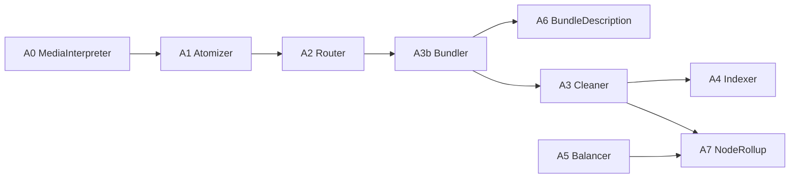

# Organize Agent 仕様（topic_id 配線版）

## 目的

A0〜A7/A5 を `topic_id` 中心で再配線し、Act Context Assembly との責務衝突を防ぐ。

## スコープ / 非スコープ

* スコープ: Agentごとの Input/Output/Emit、冪等、lease/CAS、供給責務
* 非スコープ: 実装コード、モデルプロンプト詳細

## 前提・依存

* `context/model/topic-model.md`
* `context/assembly/core.md`
* `context/assembly/bundle-schema.md`
* `organize/specs/pipeline/core.md`

## 契約（I/O）

共通入力:

* Envelope with `workspaceId`, `topicId`, `idempotencyKey`, `traceId`

共通出力:

* Firestore/GCS write
* 次イベント emit

## 配線原則（MUST）

* Organize = write path only
* Act Context Assembly = read-only only
* Organize は `act-adk-worker` を呼ばない
* Organize は Act の `PromptBundle` を生成/永続化しない
* Organize の `Bundle` は `PipelineBundle`（draft差分の中間成果物）を指す
* Act は canonical summary/evidence/index を更新しない
* `mind/` は GCS オブジェクト接頭辞として扱い、知識モデル名には使わない
* `mindtree` は legacy 用語とし、新規イベント名/実体名には使わない
* topic ごとに knowledge schema は進化可能だが、workspace/authz/path/id など platform schema は固定する

## Prompt Assembly 供給マップ（MVP）

| 供給物 | 主担当 | 保存先 | 用途 |
| --- | --- | --- | --- |
| `context_summary` | A3/A7 | topic nodes + GCS ref | focus/neighbor 文脈 |
| `evidence_refs` | A0/A1/A3 | Firestore refs + GCS | grounding |
| `relation_importance` | A3/A4 | topic edges/index | ranking |
| `recent_delta` | A2/A3 | topic draft/outline 差分 | recent changes |
| `confidence/quality` | A4/A5 | index/metrics | ranking |

### Agent配線図（Mermaid）

---

## A0 MediaInterpreterAgent

### Input
* `type=media.received`

### Output
* GCS: `mind/inputs/{inputId}.md`
* Firestore: `inputs/{inputId}`

### Emit
* `type=input.received` payload: `{ topicId, inputId }`

### 競合対策
* ledger key: `type:media.received/topicId:{topicId}/inputId:{inputId}`

---

## A1 AtomizerAgent

### Input
* `type=input.received` payload: `{ topicId, inputId }`

### Output
* GCS: `mind/atoms/{atomId}.md`
* Firestore: `atoms/{atomId}`

### Emit
* `type=atom.created` payload: `{ topicId, inputId, atomIds }`

### 競合対策
* ledger key: `type:input.received/topicId:{topicId}/inputId:{inputId}`
* 再処理時の二重 atom 生成を禁止（deterministic id推奨）

---

## A2 RouterAgent（Atom -> Draft）

### Input
* `type=atom.created` payload: `{ topicId, inputId, atomIds }`

### Output
* Firestore: `topics/{topicId}.latestDraftVersion` 更新
* GCS: `mind/drafts/{topicId}/v{n}.md`

### Emit
* `type=draft.updated` payload: `{ topicId, draftVersion, appendedAtomIds }`

### 競合対策
* lease: `topic:{topicId}`
* CAS: `latestDraftVersion`
* ledger key: `type:atom.created/topicId:{topicId}/inputId:{inputId}`

---

## A3b BundlerAgent（Draft差分 -> Bundle / Schema Proposal）

### Input
* `type=draft.updated` payload: `{ topicId, draftVersion, appendedAtomIds }`

### Output
* Firestore: `pipelineBundles/{bundleId}`
* Firestore: `topics/{topicId}/schemas/{version}`（必要時）

### Emit
* `type=bundle.created` payload: `{ topicId, bundleId, sourceDraftVersion }`
* `type=topic.schema_updated` payload: `{ topicId, schemaVersion }`（必要時）

### 競合対策
* ledger key: `type:draft.updated/topicId:{topicId}/draftVersion:{draftVersion}`
* 同一 `(topicId, draftVersion)` の bundle 二重生成禁止
* schema 更新時は `topics/{topicId}.schema_version` を CAS で進める

### Schema進化責務
* 現行 schema で表現不能な node kind / relation type / attribute set / index feature を検出する
* schema 変更が不要なら current schema を引き継ぐ
* schema 変更が必要なら新しい `schema_version` を発行する

---

## A6 BundleDescriptionAgent

### Input
* `type=bundle.created` payload: `{ topicId, bundleId }`

### Output
* GCS: `mind/bundle_desc/{bundleId}/v{n}.html`
* Firestore: `bundles/{bundleId}.descRef`

### Emit（任意）
* `type=bundle.described` payload: `{ topicId, bundleId }`

### 競合対策
* ledger key: `type:bundle.created/topicId:{topicId}/bundleId:{bundleId}/purpose:desc`
* desc version CAS

---

## A3 CleanerAgent（Bundle -> Outline/Graph）

### Input
* `type=bundle.created` payload: `{ topicId, bundleId }`
* `type=topic.schema_updated` payload: `{ topicId, schemaVersion }`（参照可能）

### Output
* GCS: `mind/outlines/{topicId}/v{n}.md`
* Firestore:
  * `topics/{topicId}.latestOutlineVersion` 更新
  * `topics/{topicId}/nodes/*`, `topics/{topicId}/edges/*` upsert

### Emit
* `type=outline.updated` payload: `{ topicId, outlineVersion }`
* `type=topic.node_changed` payload: `{ topicId, nodeId, reason }`
* `type=atom.reissued` payload: `{ topicId, atomId, reason }`

### 競合対策
* lease: `topic:{topicId}`
* outline version CAS
* ledger key: `type:bundle.created/topicId:{topicId}/bundleId:{bundleId}/purpose:apply`
* bundle二重適用禁止（appliedAt CAS）

### Schema適用責務
* 適用時点の `schema_version` を解決して node/edge/index 生成に使う
* schema と不整合な候補は `atom.reissued` で再評価へ戻せる
* 生成した node/edge は使用した `schema_version` を辿れるようにする

### Cleaner処理段階
1. bundle から claim 群を取得する
2. claim を normalize して node候補 / edge候補 / unresolved候補へ分ける
3. 既存 node と照合して entity resolution を行う
4. node を merge/create/reject 判定して upsert する
5. edge を upsert する
6. graph から outline を再構成し `latestOutlineVersion` を進める
7. changed node ごとに `topic.node_changed` を emit する
8. 確定不能候補を `atom.reissued` で戻す

---

## A4 IndexerAgent（Outline -> Index/Map）

### Input
* `type=outline.updated` payload: `{ topicId, outlineVersion }`

### Output
* Firestore: `index_items/*` upsert
* GCS: `mind/maps/{topicId}/v{n}.md`
* Firestore: `topics/{topicId}.latestMapVersion` 更新

### 競合対策
* lease: `topic:{topicId}`
* 古い版は skip/ack
* ledger key: `type:outline.updated/topicId:{topicId}/outlineVersion:{outlineVersion}`

---

## A7 NodeRollupAgent

### Input
* `type=topic.node_changed` or `node.rollup_requested`

### Output
* GCS: `mind/node_rollup/{nodeId}/v{n}.html`
* Firestore: `topics/{topicId}/nodes/{nodeId}.rollupRef` + watermark

### Emit（任意）
* `type=node.rollup.updated` payload: `{ topicId, nodeId }`

### 競合対策
* lease: `node:{nodeId}`
* watermark以下は skip/ack
* ledger key: `type:topic.node_changed/topicId:{topicId}/nodeId:{nodeId}/generation:{gen}`

### Prompt Assembly供給責務
* `context_summary_ref` を更新可能にする
* 詳細本文と注入用短要約を分離する

---

## A5 BalancerAgent

### Input
* `type=topic.metrics.updated`（または定期）

### Output
* Firestore: `organizeOps/{opId}`（推奨）

### Emit
* `topic.node_changed`, `topic.metrics.updated`

### 競合対策
* topic/node lease 推奨
* generation CAS 推奨

### Prompt Assembly供給責務
* ranking用特徴量（偏り/未解決率/冗長度）を index/metrics に反映

## 異常フロー（error/retryable/stage）

* topic不整合: `FAILED_PRECONDITION`, `retryable=false`, `stage=VALIDATE_EVENT`
* 外部依存失敗: `UNAVAILABLE`, `retryable=true`, `stage=PROCESS_AGENT`
* CAS失敗: skip/ack（正常）

## 数値パラメータ

* 個別上限は `organize/specs/pipeline/ops.md` と `act/specs/quality/backend-parameter-index.md` を参照

## 受け入れ条件（DoD）

* 全Agent I/Oが `topicId` 中心で一貫
* A2/A3/A4/A7 の ledger/lease/CAS が topic基準で定義
* Prompt Assembly は供給データを参照のみで利用できる

## 実装メモ（最小）

* legacy `outlineId` は新規仕様で使用しない
