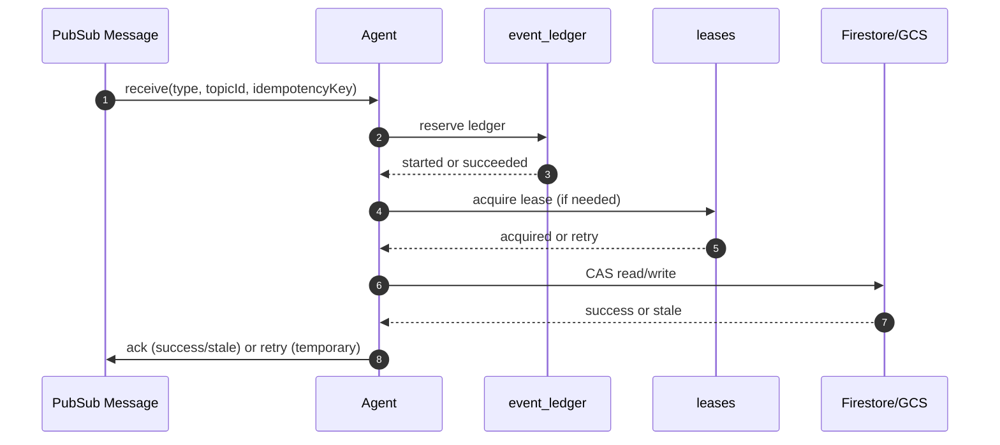

# Organize パイプライン中核仕様（Pub/Sub + Firestore + GCS）

Version: 1.1 / schemaVersion: v1

## 目的

A0〜A7/A5 のイベント駆動パイプラインを **Pub/Sub (at-least-once)** で安全運用するために、
`topic_id` 中心の共通規約を定義する。

## スコープ / 非スコープ

* スコープ: Topic/Subscription、Envelope/attributes、冪等、Lease、CAS、DLQ
* 非スコープ: Agent個別アルゴリズム、Actのstream実装

## 前提・依存

* `context/model/topic-model.md`
* `context/assembly/core.md`
* `organize/specs/pipeline/agents.md`
* `firestore/schema.md`

## 契約（I/O）

入力:

* Pub/Sub `mind-events` メッセージ
* Firestore/GCS 正本

出力:

* Agent別イベント emit
* Firestore/GCS 更新（write path）
* event ledger / lease / version cursor 更新

## 基本方針（MUST）

1. Pub/Sub は at-least-once 前提（重複/遅延/順序入れ替わりを許容）
2. 重複は event_ledger と version(CAS) で無害化する
3. 同一 topic/node 更新は lease で直列化する
4. ルーティングは `attributes.type` で行う
5. fan-out は subscription 複数化で実現する
6. Context Assembly は read-only で `mind-events` に publish しない
7. Organize は `act-adk-worker` を呼ばず、独立した write pipeline として動作する
8. `PromptBundle`（Act推論入力）と `PipelineBundle`（Organize中間成果物）を分離する
9. `mind-events` はイベントバス名としてのみ使い、知識モデル名には使わない
10. 知識モデルは `topic` / `node` / `edge` を正本用語とし、`mindtree` は新規仕様で使用しない

## Pub/Sub リソース仕様

### Topic

* `mind-events`
* `mind-events-dlq`

### Subscription（Agent単位）

| Agent | Subscription | Filter | Ordering推奨 |
| --- | --- | --- | --- |
| A0 MediaInterpreter | sub-a0 | `attributes.type="media.received"` | OFF |
| A1 Atomizer | sub-a1 | `attributes.type="input.received"` | OFF |
| A2 Router | sub-a2 | `attributes.type="atom.created"` | ON（topicId） |
| A3b Bundler | sub-a3b | `attributes.type="draft.updated"` | ON（topicId） |
| A6 BundleDesc | sub-a6 | `attributes.type="bundle.created"` | OFF |
| A3 Cleaner | sub-a3 | `attributes.type="bundle.created"` | ON（topicId） |
| A4 Indexer | sub-a4 | `attributes.type="outline.updated"` | ON（topicId） |
| A7 Rollup | sub-a7 | `attributes.type="topic.node_changed" OR attributes.type="node.rollup_requested"` | ON（nodeId） |
| A5 Balancer | sub-a5 | `attributes.type="topic.metrics.updated"` | OFF |

## Envelope 仕様

### フィールド定義

| フィールド | 必須 | 説明 |
| --- | --- | --- |
| `schemaVersion` | 必須 | スキーマ版 |
| `type` | 必須 | イベント種別 |
| `traceId` | 必須 | 分散トレースキー |
| `workspaceId` | 必須 | workspace境界 |
| `topicId` | 必須 | topic境界 |
| `uid` | 推奨 | ユーザー起点の追跡 |
| `idempotencyKey` | 必須 | 冪等キー |
| `emittedAt` | 必須 | 発行時刻 |
| `payload` | 必須 | typeごとの本文 |

### 必須フィールド

* `schemaVersion`, `type`, `traceId`, `workspaceId`, `topicId`, `idempotencyKey`, `emittedAt`, `payload`

### attributes（MUST）

* `type`
* `schemaVersion`
* `workspaceId`
* `topicId`

### attributes（SHOULD）

* `nodeId`, `inputId`, `bundleId`, `draftVersion`, `outlineVersion`

## 処理シーケンス（Mermaid）

## 競合対策（MUST）

### IdempotencyKey

推奨形式:

* `type:{type}/topicId:{topicId}/{primaryKey}:{id}`
* 例:
  * `type:draft.updated/topicId:tp_1/draftVersion:12`
  * `type:outline.updated/topicId:tp_1/outlineVersion:21`

### event_ledger

* path: `event_ledger/{ledgerId}`
* `ledgerId = sha256(idempotencyKey)` 推奨
* `status=succeeded` は即ACK
* `status=started` でlease有効ならリトライ

### Lease

* path: `leases/{resourceKey}`
* `resourceKey` 例: `topic:tp_1`, `node:nd_1`
* 取得失敗時は nack/未ack リトライ

### Version(CAS)

* topic配下の version は transaction で `current==expected` を確認
* 不一致は **skip + ACK**（正常競合吸収）

## 正常フロー

1. メッセージ受信
2. ledger確保（重複吸収）
3. lease取得（必要時）
4. version/CAS検証
5. Firestore/GCS更新
6. 次イベントemit
7. ledgerを succeeded

## 異常フロー（error/retryable/stage）

* 入力不正: `INVALID_ARGUMENT`, `retryable=false`, `stage=VALIDATE_EVENT`
* 一時依存障害: `UNAVAILABLE`, `retryable=true`, `stage=PROCESS_AGENT`
* CAS不一致: skip/ack（エラー扱いしない）
* 永続不整合: `FAILED_PRECONDITION`, `retryable=false`, `stage=PROCESS_AGENT`

## 数値パラメータ

* subscription `maxDeliveryAttempts`: 10（重処理は20可）
* `ackDeadline`: 60〜600秒
* lease TTL: 60〜300秒

## 受け入れ条件（DoD）

* 全イベントが `topicId` を持つ
* `outlineId` 依存なしでAgentが動作定義される
* duplicate/遅延イベントで整合が崩れない
* Context Assembly が write path を持たない

## 実装メモ（最小）

* ordering key は topicスコープ（A7のみnodeスコープ）
* `bundle.created` fan-out は sub-a6 / sub-a3 の2購読を維持
