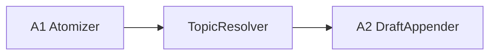

# Topic Resolution 仕様

Version: 1.0 / schemaVersion: v1

## 目的

`topic` の粒度を固定し、入力を既存 topic に入れるか新規 topic を作るかを自動判定する。

## 1. topic の粒度（MUST）

`topic` は、Act と Organize が共有する「長く育てる知識テーマ」の最小運用単位とする。

必須条件:

* 1 回の質問や 1 セッションを topic とみなさない
* 1 topic は数日から数か月かけて更新される前提でよい
* 同じ root question / 中心対象 / schema で整理できる入力群を 1 topic にまとめる
* 明らかに別テーマ・別寿命・別 access boundary なら topic を分ける

目安:

* ノード数は数十〜数百
* 同じ topic 内の入力は主要 node 群を再利用できる
* topic schema を共有できない場合は別 topic に倒す

## 2. TopicResolver の責務

`TopicResolver` は、入力をどの topic に所属させるかを自動決定する前段である。

責務:

* 既存 topic 候補の検索
* 候補 topic との関連度 scoring
* 既存 topic へ入れるか、新規 topic を切るかの判定
* 判定理由と confidence の記録

非責務:

* draft 追記
* Firestore の knowledge graph 更新
* authz 判定
* version / CAS 実行

## 3. パイプライン位置

`A2` は routing を兼務せず、解決済み `topicId` に対する draft append のみ担当する。

## 4. 自動解決フロー

1. 入力本文または atom 群から query representation を作る
2. workspace 内の既存 topic 候補を retrieval する
3. 候補 topic ごとに deterministic score を計算する
4. 上位候補のみ Gemini に渡して最終判定する
5. confidence が閾値未満なら新規 topic を作る
6. 解決結果を `resolvedTopicId` として downstream に渡す

## 5. 候補 retrieval（決定論的）

候補生成には LLM を使わない。

使用してよい信号:

* topic title
* outline summary
* top nodes / keywords
* embedding similarity
* 最近更新された node / edge

候補数:

* 上位 3〜5 件に絞る

## 6. Gemini の役割

Gemini は最終判定補助に限定する。

入力:

* 新規入力の要約
* atom / entity の要約
* 上位 topic 候補 3〜5 件
* 各候補 topic の title / short summary / representative nodes

出力（structured）:

* `decision`: `attach_existing | create_new`
* `resolvedTopicId`（既存 topic の場合）
* `confidence`: 0.0-1.0
* `reason`: 短い自然言語説明

## 7. 判定ポリシー（MUST）

* 高 confidence で単一候補が優勢なら既存 topic に attach してよい
* 候補が競る場合は既存 topic へ無理に入れず、新規 topic を優先する
* 誤 attach より新規 topic 過剰生成の方を安全側とみなす
* workspace 境界を越える候補は常に除外する

## 8. A2 への受け渡し

`TopicResolver` 後の envelope は少なくとも次を持つ。

* `workspaceId`
* `resolvedTopicId`
* `resolutionMode`: `existing | new`
* `resolutionConfidence`
* `resolutionReason`

`A2` は `resolvedTopicId` を入力として draft append を実行する。

## 9. 監査項目

必須ログ:

* `workspaceId`
* `inputId`
* `candidateTopicIds`
* `resolvedTopicId`
* `resolutionMode`
* `resolutionConfidence`
* `traceId`

## 10. 失敗時の扱い

* 候補 retrieval 失敗時は retryable error
* Gemini 判定失敗時は retryable error
* confidence が低いこと自体は error にせず `create_new` へ倒す
