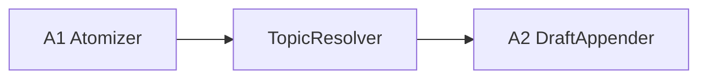

# Topic Resolution 仕様

Version: 1.1 / schemaVersion: v1

## 目的

`topic` の粒度を固定し、入力を既存 topic に入れるか新規 topic を作るかを自動判定する。

## 1. topic の粒度（MUST）

`topic` は、Act と Organize が共有する「長く育てる知識テーマ」の最小運用単位とする。

必須条件:

* 1 回の質問や 1 セッションを topic とみなさない
* 1 topic は数日から数か月かけて更新される前提でよい
* 同じ root question / 中心対象 / schema で整理できる入力群を 1 topic にまとめる
* 明らかに別テーマ・別寿命・別 access boundary なら topic を分ける

目安:

* ノード数は数十〜数百
* 同じ topic 内の入力は主要 node 群を再利用できる
* topic schema を共有できない場合は別 topic に倒す

## 2. Topic Lifecycle（MUST）

`topic` は長期運用で増減・統合・分割されるため、state を持つ。

最小 state:

* `active`
  * 通常運用中。新規入力の attach 候補に入れてよい
* `archived`
  * 参照専用。新規入力の attach 候補に入れない
* `merged`
  * 他 topic へ統合済み。新規入力の attach 候補に入れない
* `split_source`
  * 分割元。既存内容の参照は許すが、新規入力の attach 候補には原則入れない
* `split_child`
  * 分割後に新設された topic。通常は `active` と同様に扱ってよい

補助フィールド:

* `mergedToTopicId`（`state=merged` のとき必須）
* `archivedAt`
* `archiveReason`
* `splitFromTopicId`（`state=split_child` のとき任意）

Resolver の候補可否:

* `active`: 候補に入れてよい
* `split_child`: 候補に入れてよい
* `archived`: 候補から除外する
* `merged`: 候補から除外する
* `split_source`: 候補から除外する

運用原則:

* archived topic は検索・閲覧対象であっても routing 対象にはしない
* merged topic は UI 上でリダイレクト先を表示してよいが、Resolver は `mergedToTopicId` を自動追跡して attach してはならない
* split_source から split_child への自動 attach は行わない。通常の candidate scoring を通す
* lifecycle 変更は TopicResolver の責務ではなく、別 phase または human review の責務とする

## 3. TopicResolver の責務

`TopicResolver` は、入力をどの topic に所属させるかを自動決定する前段である。

責務:

* 既存 topic 候補の検索
* 候補 topic との関連度 scoring
* 既存 topic へ入れるか、新規 topic を切るかの判定
* 判定理由と confidence の記録

非責務:

* draft 追記
* Firestore の knowledge graph 更新
* authz 判定
* version / CAS 実行

## 4. パイプライン位置

`A2` は routing を兼務せず、解決済み `topicId` に対する draft append のみ担当する。

## 5. 自動解決フロー

1. 入力本文または atom 群から query representation を作る
2. workspace 内の既存 topic 候補を retrieval する（`state in {active, split_child}` のみ）
3. 候補 topic ごとに deterministic score を計算する
4. 上位候補のみ Gemini に渡して最終判定する
5. confidence が閾値未満なら新規 topic を作る
6. 解決結果を `resolvedTopicId` として downstream に渡す

## 6. 候補 retrieval（決定論的）

候補生成には LLM を使わない。

使用してよい信号:

* topic title
* outline summary
* top nodes / keywords
* embedding similarity
* 最近更新された node / edge

候補数:

* 上位 3〜5 件に絞る

除外条件:

* `workspaceId` が異なる topic
* `state=archived`
* `state=merged`
* `state=split_source`

## 7. Gemini の役割

Gemini は最終判定補助に限定する。

入力:

* 新規入力の要約
* atom / entity の要約
* 上位 topic 候補 3〜5 件
* 各候補 topic の title / short summary / representative nodes

出力（structured）:

* `decision`: `attach_existing | create_new`
* `resolvedTopicId`（既存 topic の場合）
* `confidence`: 0.0-1.0
* `reason`: 短い自然言語説明

## 8. 判定ポリシー（MUST）

* 高 confidence で単一候補が優勢なら既存 topic に attach してよい
* 候補が競る場合は既存 topic へ無理に入れず、新規 topic を優先する
* 誤 attach より新規 topic 過剰生成の方を安全側とみなす
* workspace 境界を越える候補は常に除外する
* `archived`, `merged`, `split_source` には attach しない
* merged topic が入力文面上もっとも近く見えても、そのまま `mergedToTopicId` に attach せず `create_new` を含めて再判定する

推奨閾値:

* `attach_existing` は `confidence >= 0.80` を最低条件とする
* 上位2候補の score 差が小さい場合は Gemini 出力にかかわらず `create_new` を優先してよい

`reason` の最小テンプレート:

* `attach_existing`: 「中心対象・root question・主要 node が既存 topic と一致」
* `create_new`: 「候補が競合 / schema が合わない / 寿命が別 / access boundary が別」

## 9. A2 への受け渡し

`TopicResolver` 後の envelope は少なくとも次を持つ。

* `workspaceId`
* `resolvedTopicId`
* `resolutionMode`: `existing | new`
* `resolutionConfidence`
* `resolutionReason`
* `topicLifecycleStateAtResolution`

`A2` は `resolvedTopicId` を入力として draft append を実行する。

## 10. 監査項目

必須ログ:

* `workspaceId`
* `inputId`
* `candidateTopicIds`
* `candidateTopicStates`
* `resolvedTopicId`
* `resolutionMode`
* `resolutionConfidence`
* `resolutionReason`
* `traceId`

推奨ログ:

* `topCandidateScores`
* `retrievalQuerySummary`
* `excludedTopicIds` とその理由

## 11. Lifecycle 変更の責務境界

Topic lifecycle の変更主体は TopicResolver ではない。

MUST:

* `archive`
* `merge`
* `split`
* `rename`

は `organizeOps` または専用運用フローで提案・承認・適用する。

TopicResolver は次だけを行う:

* 現在 state を参照する
* routing 対象外 state を候補から除外する
* 判定時点の state を監査ログへ残す

## 12. 失敗時の扱い

* 候補 retrieval 失敗時は retryable error
* Gemini 判定失敗時は retryable error
* confidence が低いこと自体は error にせず `create_new` へ倒す
